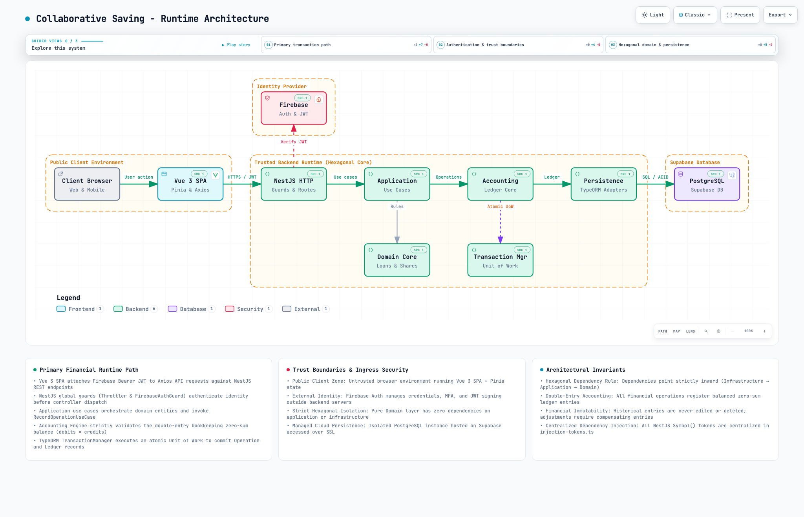

# Collaborative Saving

> Plataforma moderna para la gestión integral de grupos y fondos de ahorro comunitario.

Collaborative Saving permite administrar aportes de socios, suscripciones de acciones, emisión y seguimiento de préstamos, y liquidación de rendimientos, garantizando la consistencia financiera mediante un motor de **contabilidad de partida doble**.

---

## 🏛️ Arquitectura del Sistema

El sistema implementa una **Arquitectura Hexagonal estricta** en el backend (NestJS) y una arquitectura **Feature-based** en el frontend (Vue 3 + Pinia), respaldado por PostgreSQL y Firebase Auth.

<p align="center">
  <picture>
    <source media="(prefers-color-scheme: dark)" srcset="./docs/runtime-architecture.dark.png">
    <source media="(prefers-color-scheme: light)" srcset="./docs/runtime-architecture.light.png">
    
  </picture>
</p>

> 💡 **Diagrama Interactivo:** Puedes explorar el flujo transaccional con zoom, tooltips e inspección de trazas abriendo [`docs/runtime-architecture.html`](./docs/runtime-architecture.html) directamente en tu navegador.

---

## 🚀 Características Principales

- **Gestión de Socios y Membresías:** Control de perfiles, estados de cuenta individuales y roles.
- **Aportes y Acciones:** Suscripción, compra y venta de acciones con cálculo de dividendos.
- **Préstamos y Amortizaciones:** Solicitud, aprobación, generación de tablas de amortización y registro de pagos.
- **Reuniones Periódicas:** Módulo de asambleas para registro masivo de aportes y cobros en tiempo real.
- **Motor Contable de Partida Doble:** Invariante de suma cero en todas las transacciones monetarias (`ledger_entries`).

---

## 🛠️ Stack Tecnológico

| Capa | Tecnología | Descripción |
| :--- | :--- | :--- |
| **Frontend** | Vue 3 + Vite + Pinia | SPA modular basada en features y componentes accesibles. |
| **Backend** | NestJS + TypeScript | API REST con arquitectura hexagonal y puertos/adaptadores. |
| **Base de Datos** | PostgreSQL (Supabase) + TypeORM | Esquema relacional con migraciones versionadas y ledger contable. |
| **Autenticación** | Firebase Auth | Autenticación JWT y control de acceso basado en guardias. |
| **Contenedores** | Docker & Docker Compose | Entornos reproducibles para desarrollo y despliegue. |

---

## 📚 Documentación

Para profundizar en los detalles técnicos y de negocio, consulta los documentos de la carpeta [`docs/`](./docs/):

- 💼 [Contexto de Negocio](./docs/business.md) — Objetivos, actores y modelo operativo.
- 📐 [Arquitectura General](./docs/architecture.md) — Capas, puertos, adaptadores y reglas de dominio.
- 🗄️ [Modelo de Datos](./docs/data-model.md) — Esquema de base de datos y relaciones.
- 📒 [Mapeo Contable](./docs/accounting-map.md) — Reglas del libro mayor y asientos contables.
- ☁️ [Infraestructura y Despliegue](./docs/infrastructure.md) — Topología en Supabase y Docker.
- 🎨 [Sistema de Diseño](./docs/design.md) — Guías visuales y componentes de UI.
- ⚖️ [Registro de Decisiones (ADRs)](./docs/adrs/README.md) — Decisiones arquitectónicas históricas.
- 🤖 [Guía para Agentes de IA (AGENTS.md)](./AGENTS.md) — Contexto para asistentes de codificación.
- 🤝 [Guía de Contribución (CONTRIBUTING.md)](./CONTRIBUTING.md) — Convenciones de Git y flujo de trabajo.

---

## 💻 Inicio Rápido

### Requisitos Previos

- Node.js >= 18
- npm >= 9
- Docker y Docker Compose (opcional para base de datos local)

### Instalación

1. Clona el repositorio:
   ```bash
   git clone https://github.com/fabian-martinez/collaborative-saving.git
   cd collaborative-saving
   ```

2. Instala las dependencias en todos los paquetes:
   ```bash
   npm run install:all
   ```

3. Configura las variables de entorno:
   ```bash
   cp backend/.env.example backend/.env
   cp frontend-v2/.env.example frontend-v2/.env
   ```

### Desarrollo

Inicia backend y frontend en paralelo con un solo comando:

```bash
npm run dev
```

- **Frontend:** `http://localhost:5173`
- **Backend API:** `http://localhost:3000`
- **Swagger Docs:** `http://localhost:3000/api/docs`

---

## 🧪 Pruebas y Calidad de Código

```bash
# Pruebas unitarias backend
cd backend && npm run test

# Pruebas unitarias frontend
cd frontend-v2 && npm run test

# Validación de Markdown
npm run lint:md
```
