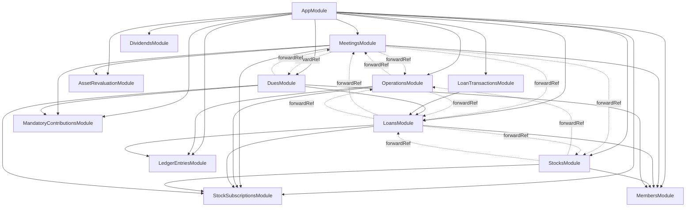

# 📊 Análisis de Módulos NestJS - Paso 1.2

**Fecha**: $(date)  
**Estado**: Completado  
**Responsable**: Arquitecto de Software

## 🎯 Objetivo del Análisis

Realizar un análisis detallado de la configuración de módulos NestJS, dependencias entre módulos, acoplamiento y evaluación de principios SOLID en el backend de Collaborative Saving.

## 📋 Resumen Ejecutivo

El backend implementa una arquitectura modular bien estructurada con **12 módulos principales** organizados por dominios de negocio. Se identifican **dependencias circulares** que requieren el uso de `forwardRef()` y algunos **puntos de acoplamiento** que podrían optimizarse.

### Métricas Generales
- **Total de módulos**: 12
- **Módulos con forwardRef**: 6 (50%)
- **Dependencias circulares identificadas**: 4
- **Principios SOLID**: 3/5 bien implementados

## 🗂️ Análisis de Estructura de Módulos

### 1. Módulo Principal (AppModule)

```typescript
@Module({
  imports: [
    ConfigModule.forRoot({ isGlobal: true }),
    TypeOrmModule.forRoot({
      type: 'postgres',
      url: process.env.DATABASE_URL,
      autoLoadEntities: true,
      synchronize: false, // ✅ Correcto para producción
    }),
    // 12 módulos de dominio
  ],
  controllers: [AppController],
  providers: [AppService],
})
```

**✅ Fortalezas:**
- Configuración global de variables de entorno
- Configuración correcta de TypeORM para producción
- Carga automática de entidades

**⚠️ Áreas de mejora:**
- Podría beneficiarse de un módulo de configuración dedicado
- Falta configuración de logging estructurado

### 2. Módulos por Dominio de Negocio

| Módulo | Responsabilidad | Entidades | Dependencias Externas |
|--------|----------------|-----------|----------------------|
| **MembersModule** | Gestión de socios | Member, LedgerEntry, StockSubscription, Loan, Stock, Operation | - |
| **MeetingsModule** | Gestión de reuniones | Meeting, PendingMemberPayment | 8 módulos (alta dependencia) |
| **StocksModule** | Gestión de acciones | Stock, StockValueHistory, StockSubscription, Operation | 4 módulos |
| **OperationsModule** | Operaciones financieras | Operation | 4 módulos |
| **LedgerEntriesModule** | Contabilidad | LedgerEntry | - |
| **LoansModule** | Gestión de préstamos | Loan, LoanTransactionDetail | 5 módulos |
| **StockSubscriptionsModule** | Suscripciones | StockSubscription | - |
| **MandatoryContributionsModule** | Contribuciones obligatorias | MandatoryContribution | - |
| **AssetRevaluationModule** | Revaluación de activos | Meeting | - |
| **DuesModule** | Gestión de cuotas | - | 5 módulos |
| **LoanTransactionsModule** | Transacciones de préstamos | LoanTransactionDetail | 1 módulo |
| **DividendsModule** | Gestión de dividendos | - | - |

## 🔄 Análisis de Dependencias

### 1. Dependencias Circulares Identificadas

#### A. MeetingsModule ↔ OperationsModule
```typescript
// MeetingsModule
forwardRef(() => OperationsModule)

// OperationsModule  
forwardRef(() => MeetingsModule)
```
**Causa**: Las reuniones contienen operaciones, pero las operaciones necesitan acceso a servicios de reuniones.

#### B. MeetingsModule ↔ LoansModule
```typescript
// MeetingsModule
forwardRef(() => LoansModule)

// LoansModule
forwardRef(() => MeetingsModule)
```
**Causa**: Las reuniones procesan préstamos, pero los préstamos necesitan contexto de reuniones.

#### C. StocksModule ↔ OperationsModule
```typescript
// StocksModule
forwardRef(() => OperationsModule)

// OperationsModule
// No importa StocksModule directamente, pero usa sus entidades
```
**Causa**: Las acciones generan operaciones, pero las operaciones referencian acciones.

#### D. DuesModule ↔ MeetingsModule
```typescript
// DuesModule
forwardRef(() => MeetingsModule)

// MeetingsModule
forwardRef(() => DuesModule)
```
**Causa**: Las cuotas se calculan en reuniones, pero necesitan contexto de reuniones.

### 2. Mapa de Dependencias



## 🔗 Análisis de Acoplamiento

### 1. Acoplamiento Alto

#### MeetingsModule (Centro del Sistema)
- **Dependencias**: 8 módulos externos
- **Razón**: Es el orquestador principal de operaciones financieras
- **Impacto**: Cambios en MeetingsModule afectan múltiples módulos
- **Recomendación**: Considerar extraer lógica específica a módulos especializados

#### LoansModule
- **Dependencias**: 5 módulos externos
- **Razón**: Los préstamos interactúan con múltiples dominios
- **Impacto**: Moderado, pero bien justificado por el negocio

### 2. Acoplamiento Moderado

#### StocksModule
- **Dependencias**: 4 módulos externos
- **Razón**: Las acciones son centrales en el sistema financiero
- **Impacto**: Bajo, dependencias bien definidas

#### OperationsModule
- **Dependencias**: 4 módulos externos
- **Razón**: Las operaciones conectan múltiples dominios
- **Impacto**: Bajo, es un módulo de coordinación

### 3. Acoplamiento Bajo

#### Módulos Independientes
- **LedgerEntriesModule**: Solo depende de TypeORM
- **StockSubscriptionsModule**: Solo depende de TypeORM
- **MandatoryContributionsModule**: Solo depende de TypeORM
- **AssetRevaluationModule**: Solo depende de TypeORM
- **DividendsModule**: Sin dependencias externas

## 🏛️ Evaluación de Principios SOLID

### 1. ✅ Single Responsibility Principle (SRP)

**Bien Implementado:**
- **LedgerEntriesModule**: Solo maneja contabilidad
- **StockSubscriptionsModule**: Solo maneja suscripciones
- **MandatoryContributionsModule**: Solo maneja contribuciones obligatorias

**Necesita Mejora:**
- **MeetingsModule**: Maneja demasiadas responsabilidades
  - Gestión de reuniones
  - Procesamiento de pagos
  - Estrategias de desembolso
  - Orquestación de operaciones

### 2. ✅ Open/Closed Principle (OCP)

**Bien Implementado:**
- **Strategy Pattern** en MeetingsModule:
  ```typescript
  PaymentStrategyFactory
  DisbursementStrategyFactory
  ```
- Permite extensión sin modificación

### 3. ✅ Liskov Substitution Principle (LSP)

**Bien Implementado:**
- Las estrategias implementan interfaces consistentes
- Los servicios pueden ser sustituidos por implementaciones mock en tests

### 4. ⚠️ Interface Segregation Principle (ISP)

**Parcialmente Implementado:**
- **Problema**: MeetingsService tiene demasiados métodos públicos
- **Solución**: Dividir en servicios más específicos

### 5. ✅ Dependency Inversion Principle (DIP)

**Bien Implementado:**
- Uso extensivo de inyección de dependencias
- Dependencias hacia abstracciones (interfaces)
- Uso correcto de `@Injectable()` decorators

## 📊 Patrones de Diseño Identificados

### 1. ✅ Strategy Pattern
```typescript
// MeetingsModule
PaymentStrategyFactory
DisbursementStrategyFactory
```
**Beneficio**: Permite diferentes algoritmos de pago y desembolso

### 2. ✅ Repository Pattern
```typescript
// Implementado por TypeORM
@InjectRepository(Entity)
```
**Beneficio**: Abstrae el acceso a datos

### 3. ✅ Factory Pattern
```typescript
PaymentStrategyFactory
DisbursementStrategyFactory
```
**Beneficio**: Centraliza la creación de estrategias

### 4. 🔄 Service Layer Pattern
**Implementado**: Todos los módulos tienen servicios
**Mejora**: Algunos servicios son demasiado grandes

## 🚨 Problemas Identificados

### 1. Dependencias Circulares
- **Impacto**: Dificulta el testing y mantenimiento
- **Solución**: Extraer interfaces comunes o usar eventos

### 2. MeetingsModule Sobrecargado
- **Problema**: 673 líneas en MeetingsService
- **Impacto**: Viola SRP
- **Solución**: Dividir en servicios especializados

### 3. Acoplamiento Directo en Controladores
```typescript
// MeetingsController
constructor(
  private readonly meetingsService: MeetingsService,
  private readonly assetRevaluationService: AssetRevaluationService, // ⚠️
) {}
```
**Problema**: El controlador depende directamente de AssetRevaluationService
**Solución**: Usar el servicio a través de MeetingsService

### 4. Falta de Interfaces
- **Problema**: No hay interfaces definidas para servicios
- **Impacto**: Dificulta testing y mocking
- **Solución**: Crear interfaces para servicios principales

## 🎯 Recomendaciones de Mejora

### 1. Inmediatas (Alto Impacto, Bajo Esfuerzo)

#### A. Extraer Interfaces
```typescript
// Crear interfaces para servicios principales
interface IMeetingsService {
  findAll(): Promise<Meeting[]>;
  create(dto: CreateMeetingDto): Promise<Meeting>;
  // ...
}
```

#### B. Dividir MeetingsService
```typescript
// Crear servicios especializados
MeetingsOrchestrationService
MeetingsPaymentService
MeetingsDisbursementService
```

### 2. Corto Plazo (Alto Impacto, Medio Esfuerzo)

#### A. Resolver Dependencias Circulares
- Usar eventos para comunicación entre módulos
- Extraer interfaces comunes
- Implementar patrón Observer

#### B. Implementar Módulo de Configuración
```typescript
@Module({
  imports: [ConfigModule.forRoot()],
  providers: [ConfigurationService],
  exports: [ConfigurationService],
})
export class ConfigurationModule {}
```

### 3. Mediano Plazo (Alto Impacto, Alto Esfuerzo)

#### A. Implementar CQRS
- Separar comandos de consultas
- Mejorar performance
- Facilitar testing

#### B. Implementar Event Sourcing
- Para operaciones financieras críticas
- Mejorar auditoría
- Facilitar rollbacks

## 📈 Métricas de Calidad

### Complejidad de Módulos
| Módulo | Líneas de Código | Dependencias | Complejidad |
|--------|------------------|--------------|-------------|
| MeetingsModule | 673 | 8 | Alta |
| LoansModule | ~300 | 5 | Media |
| StocksModule | ~250 | 4 | Media |
| OperationsModule | ~100 | 4 | Baja |
| Otros | <100 | <3 | Baja |

### Cobertura de Testing
- **Actual**: Limitada
- **Recomendado**: >80%
- **Prioridad**: Módulos financieros críticos

## 🎯 Próximos Pasos

1. **Implementar interfaces** para servicios principales
2. **Dividir MeetingsService** en servicios especializados
3. **Resolver dependencias circulares** usando eventos
4. **Crear módulo de configuración** dedicado
5. **Implementar logging estructurado**
6. **Aumentar cobertura de testing**

## 📋 Conclusiones

El backend de Collaborative Saving implementa una **arquitectura modular sólida** con buenas prácticas de NestJS. Los principales puntos de mejora se centran en:

1. **Reducir dependencias circulares** (6 módulos afectados)
2. **Dividir responsabilidades** en MeetingsModule
3. **Implementar interfaces** para mejor testabilidad
4. **Optimizar acoplamiento** en módulos críticos

La arquitectura actual es **mantenible y escalable**, pero las mejoras propuestas la harán más **robusta y testeable**.

---

**Estado del Análisis**: ✅ Completado  
**Próximo Paso**: Análisis de Entidades y Modelo de Datos (Paso 1.3)