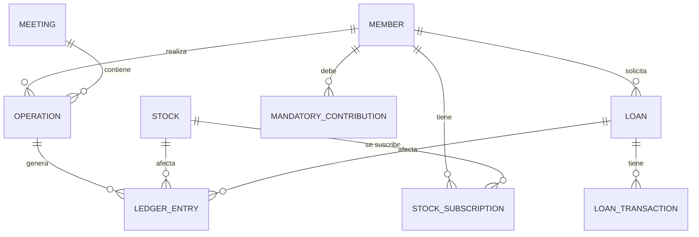

# 🏗️ Arquitectura Actual - Backend Collaborative Saving

## 📋 Resumen Ejecutivo

El backend de **Collaborative Saving** está construido con **NestJS** siguiendo una arquitectura modular basada en dominios de negocio. La aplicación gestiona un sistema de ahorro colaborativo con funcionalidades financieras complejas que incluyen gestión de miembros, acciones, préstamos, reuniones y contabilidad de doble entrada.

## 🎯 Arquitectura General

### Estilo Arquitectónico
- **Patrón**: Arquitectura en Capas (Layered Architecture)
- **Framework**: NestJS (Node.js)
- **Base de Datos**: PostgreSQL con TypeORM
- **Comunicación**: REST API con Swagger/OpenAPI

### Principios Arquitectónicos Aplicados
- ✅ **Separación de Responsabilidades**: Cada módulo tiene responsabilidades específicas
- ✅ **Inversión de Dependencias**: Uso de inyección de dependencias de NestJS
- ✅ **Modularidad**: Organización por dominios de negocio
- ⚠️ **Principio de Responsabilidad Única**: Necesita revisión en algunos servicios
- ⚠️ **Abierto/Cerrado**: Algunos módulos podrían ser más extensibles

## 🗂️ Estructura de Módulos

### Módulos Principales

| Módulo | Responsabilidad | Dependencias |
|--------|----------------|--------------|
| **Members** | Gestión de socios/miembros | - |
| **Meetings** | Gestión de reuniones y operaciones | Operations, AssetRevaluation |
| **Stocks** | Gestión de tipos de acciones | - |
| **StockSubscriptions** | Suscripciones de acciones por miembro | Members, Stocks |
| **Loans** | Gestión de préstamos | Members |
| **LoanTransactions** | Transacciones de préstamos | Loans |
| **Operations** | Operaciones financieras generales | Meetings |
| **LedgerEntries** | Contabilidad de doble entrada | Operations |
| **MandatoryContributions** | Contribuciones obligatorias | Members |
| **AssetRevaluation** | Revaluación de activos | Stocks |
| **Dues** | Gestión de cuotas | Members |
| **Dividends** | Gestión de dividendos | Stocks |

### Módulo Principal (AppModule)
```typescript
@Module({
  imports: [
    ConfigModule.forRoot({ isGlobal: true }),
    TypeOrmModule.forRoot({
      type: 'postgres',
      url: process.env.DATABASE_URL,
      autoLoadEntities: true,
      synchronize: false,
    }),
    // ... todos los módulos de dominio
  ],
  controllers: [AppController],
  providers: [AppService],
})
```

## 🗄️ Modelo de Datos

### Entidades Principales

#### 1. Member (Miembro)
```typescript
@Entity('members')
class Member {
  id: string;                    // UUID
  name: string;                  // Nombre completo
  email: string;                 // Email único
  identificationNumber: string;  // Cédula única
  role: string;                  // Rol (member, admin, etc.)
  status: string;                // Estado (active, inactive)
  address?: string;              // Dirección
  phone?: string;                // Teléfono
  beneficiary?: string;          // Beneficiario
  registrationDate: Date;        // Fecha de registro
  deletedAt?: Date;              // Soft delete
}
```

#### 2. Stock (Acción)
```typescript
@Entity('stocks')
class Stock {
  id: string;                    // UUID
  type: string;                  // Tipo de acción (único)
  value: number;                 // Valor actual
  monthlyContribution: number;   // Contribución mensual obligatoria
  isGuaranteed: boolean;         // Tiene rendimiento garantizado
  guaranteedYield?: number;      // Rendimiento garantizado
  behavior: StockBehavior;       // CAPITAL_APPRECIATION | DIVIDEND_YIELD
  deletedAt?: Date;              // Soft delete
}
```

#### 3. Meeting (Reunión)
```typescript
@Entity('meetings')
class Meeting {
  id: string;                    // UUID
  date: Date;                    // Fecha de la reunión
  status: string;                // active | closed
  notes?: string;                // Notas de la reunión
  operations: Operation[];       // Operaciones realizadas
}
```

#### 4. Operation (Operación)
```typescript
@Entity('operations')
class Operation {
  id: string;                    // UUID
  meetingId: string;             // Reunión asociada
  memberId: string;              // Miembro involucrado
  operationType: string;         // Tipo de operación
  amount: number;                // Monto
  description?: string;          // Descripción
  createdAt: Date;               // Fecha de creación
  meeting: Meeting;              // Relación con reunión
  member: Member;                // Relación con miembro
  ledgerEntries: LedgerEntry[];  // Asientos contables
}
```

#### 5. LedgerEntry (Asiento Contable)
```typescript
@Entity('ledger_entries')
class LedgerEntry {
  id: string;                    // UUID
  operationId: string;           // Operación asociada
  accountType: string;           // Tipo de cuenta
  description?: string;          // Descripción
  amount: number;                // Monto (positivo=debe, negativo=haber)
  createdAt: Date;               // Fecha de creación
  operation: Operation;          // Relación con operación
  // Referencias opcionales a entidades específicas
  loanId?: string;
  stockId?: string;
  mandatoryContributionId?: string;
  stockSubscriptionId?: string;
}
```

### Relaciones Principales



## 🔄 Flujos de Negocio Principales

### 1. Flujo de Reunión
```
1. Crear Reunión → 2. Registrar Operaciones → 3. Generar Asientos Contables → 4. Cerrar Reunión
```

### 2. Flujo de Operación Financiera
```
1. Validar Operación → 2. Crear Operation → 3. Generar LedgerEntries → 4. Actualizar Estados
```

### 3. Flujo de Préstamo
```
1. Solicitar Préstamo → 2. Aprobar → 3. Desembolsar → 4. Registrar Transacciones → 5. Generar Cuotas
```

## 🏛️ Patrones de Diseño Identificados

### Patrones Implementados
- ✅ **Repository Pattern**: TypeORM como ORM
- ✅ **Dependency Injection**: NestJS IoC Container
- ✅ **DTO Pattern**: Data Transfer Objects para validación
- ✅ **Service Layer**: Lógica de negocio en servicios
- ✅ **Controller Pattern**: Manejo de HTTP requests
- ✅ **Entity Pattern**: Modelado de datos con TypeORM

### Patrones que Podrían Implementarse
- 🔄 **Factory Pattern**: Para creación de operaciones complejas
- 🔄 **Strategy Pattern**: Para diferentes tipos de cálculos
- 🔄 **Observer Pattern**: Para notificaciones de eventos
- 🔄 **Command Pattern**: Para operaciones reversibles

## 📊 Análisis de Dependencias

### Dependencias Críticas
1. **Meetings → Operations**: Las reuniones dependen de las operaciones
2. **Operations → LedgerEntries**: Las operaciones generan asientos contables
3. **Members → (Multiple)**: Los miembros están en el centro del sistema

### Acoplamiento Identificado
- **Alto Acoplamiento**: MeetingsController depende directamente de AssetRevaluationService
- **Acoplamiento Moderado**: Múltiples módulos dependen de Members
- **Bajo Acoplamiento**: Stocks es relativamente independiente

## 🔧 Configuración Técnica

### Base de Datos
```typescript
TypeOrmModule.forRoot({
  type: 'postgres',
  url: process.env.DATABASE_URL,
  autoLoadEntities: true,
  synchronize: false, // ✅ Correcto para producción
})
```

### Validación
```typescript
app.useGlobalPipes(
  new ValidationPipe({
    whitelist: true, // ✅ Solo propiedades definidas en DTOs
  }),
)
```

### Documentación API
- **Swagger/OpenAPI**: Configurado en `/api`
- **Decoradores**: @ApiProperty, @ApiOperation, @ApiResponse
- **DTOs**: Validación con class-validator

## 🎯 Puntos Fuertes Identificados

### ✅ Fortalezas
1. **Modularidad**: Organización clara por dominios de negocio
2. **Documentación**: Swagger bien configurado
3. **Validación**: Uso consistente de DTOs y validaciones
4. **TypeScript**: Tipado fuerte en toda la aplicación
5. **Soft Delete**: Implementado en entidades principales
6. **Configuración**: Variables de entorno bien manejadas
7. **Testing**: Estructura de tests configurada

### ⚠️ Áreas de Mejora Identificadas

#### 1. Organización de Código
- **Problema**: Algunos controladores son muy grandes (MeetingsController)
- **Impacto**: Dificulta mantenimiento y testing
- **Solución**: Dividir en controladores más específicos

#### 2. Lógica de Negocio
- **Problema**: Lógica compleja en controladores
- **Impacto**: Viola principios SOLID
- **Solución**: Mover lógica a servicios especializados

#### 3. Manejo de Errores
- **Problema**: Manejo inconsistente de errores
- **Impacto**: Dificulta debugging y UX
- **Solución**: Implementar filtros globales de excepciones

#### 4. Testing
- **Problema**: Cobertura de tests limitada
- **Impacto**: Riesgo de regresiones
- **Solución**: Implementar tests unitarios y de integración

#### 5. Performance
- **Problema**: Consultas N+1 potenciales
- **Impacto**: Degradación de performance
- **Solución**: Optimizar consultas con relaciones

## 📈 Métricas Actuales

### Complejidad
- **Módulos**: 12 módulos principales
- **Entidades**: ~15 entidades principales
- **Controladores**: 12 controladores
- **Servicios**: ~15 servicios

### Cobertura de Funcionalidades
- ✅ CRUD básico para todas las entidades
- ✅ Operaciones financieras complejas
- ✅ Sistema de contabilidad
- ✅ Gestión de reuniones
- ⚠️ Testing limitado
- ⚠️ Logging estructurado limitado

## 🚀 Próximos Pasos

1. **Análisis Detallado**: Revisar cada módulo individualmente
2. **Identificación de Problemas**: Detectar anti-patrones específicos
3. **Propuesta de Mejoras**: Crear plan de refactoring detallado
4. **Implementación**: Ejecutar mejoras por fases

---

**Fecha de análisis**: $(date)
**Versión**: 1.0
**Estado**: Análisis inicial completado