# Diagramas de Arquitectura – C4 (Mermaid)

> Referencia oficial: https://mermaid.js.org/syntax/c4.html

## 1) System Context (C4Context)

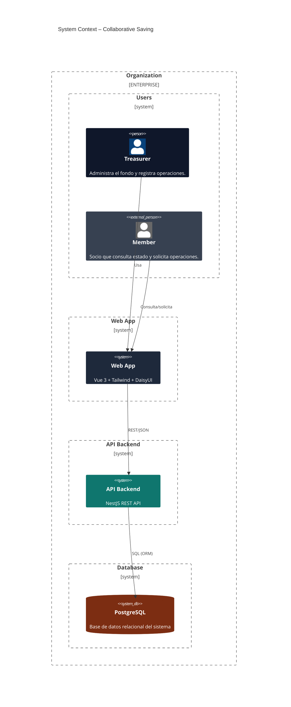

## 2) Container Diagram (C4Container)

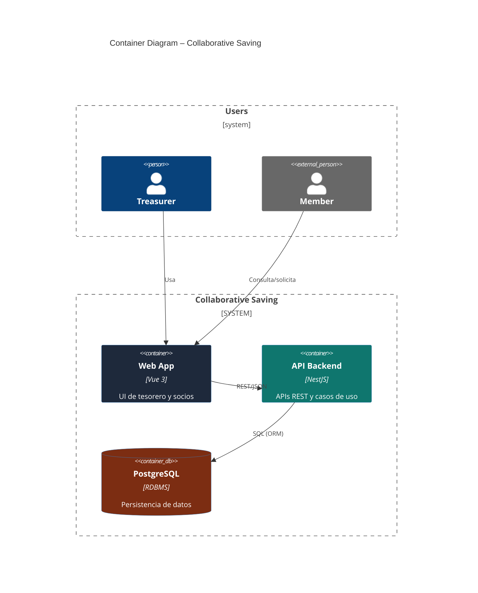

## 3) Component Diagram (C4Component)

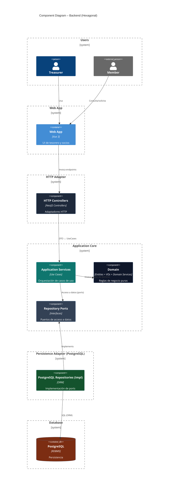

## 4) ERD del Dominio (simplificado)

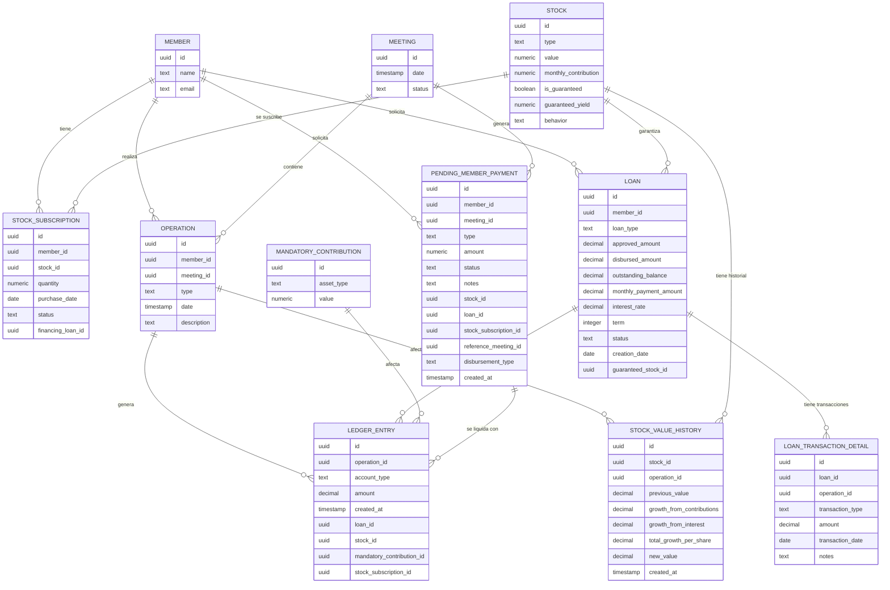

## 7) State Diagram – StockSubscription

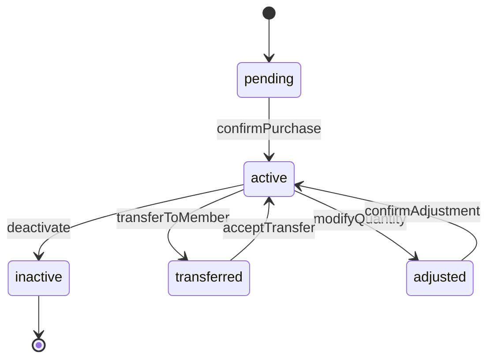

## 8) State Diagram – Loan

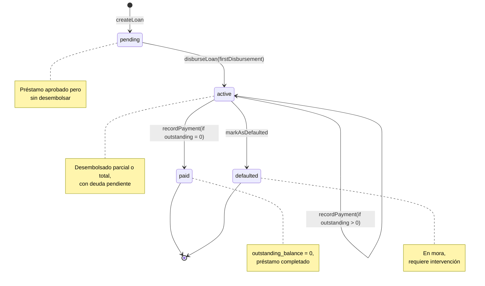

## 9) State Diagram – Meeting

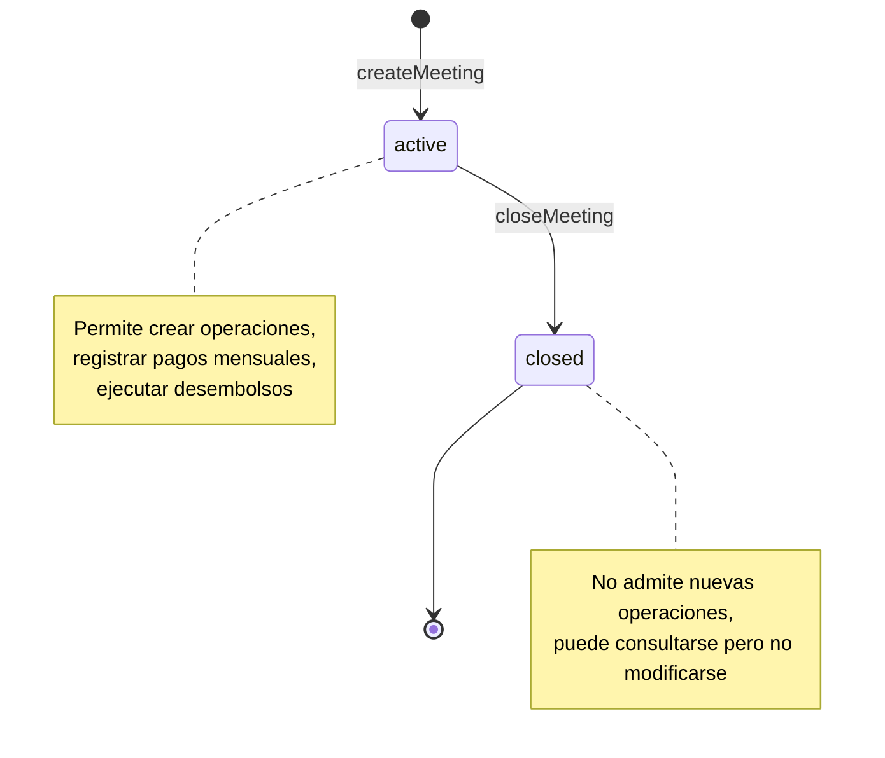

## 10) State Diagram – PendingMemberPayment

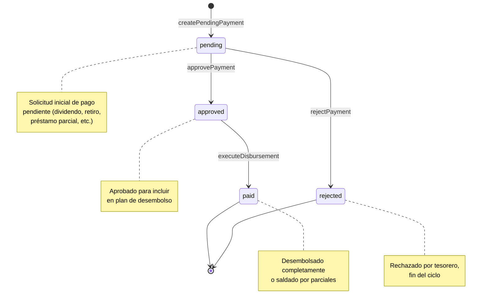

## 11) State Diagram – Member

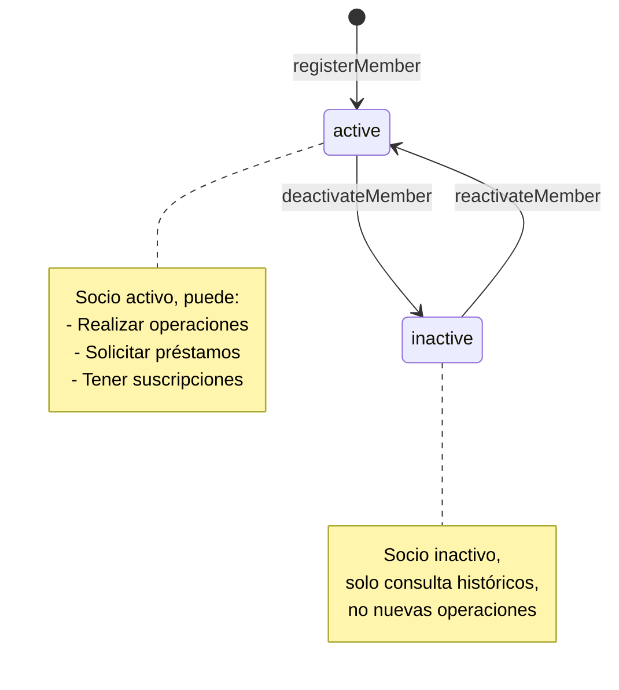

## 12) Secuencia – Revaluación Mensual (Preview → Approve)

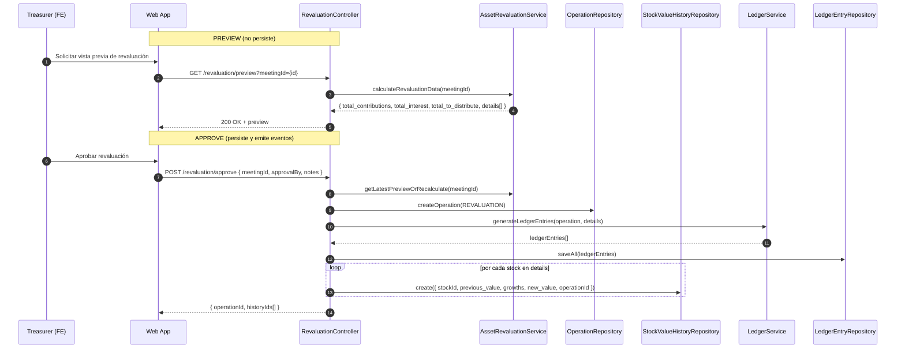

- Notas:
  - Preview no crea `Operation` ni `StockValueHistory`.
  - Approve persiste `Operation + LedgerEntries` y `StockValueHistory` por acción, y emite `StockValueRevalued`.

## 13) Secuencia – TransferStockSubscription (fromMemberId / fromLots / FIFO)

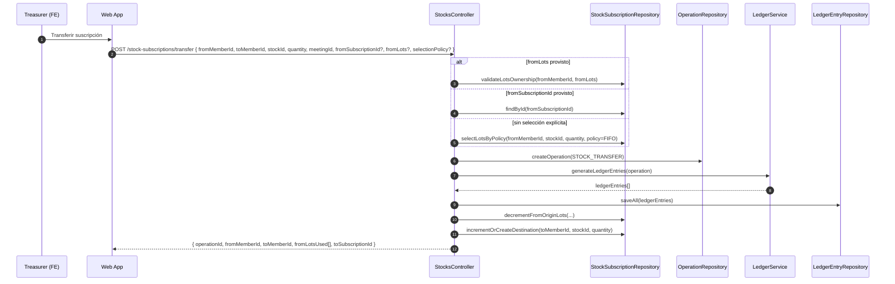

- Notas:
  - `fromMemberId` siempre requerido; `fromSubscriptionId` o `fromLots[]` son opcionales.
  - Si no se especifica lote(s), aplicar `selectionPolicy` (por defecto FIFO, solo suscripciones sin crédito).
  - En transferencias multi-lote, devolver `fromLotsUsed[]` para trazabilidad.

---

Estos diagramas complementan el modelo textual y ayudan a discutir reglas e invariantes antes de implementar.
