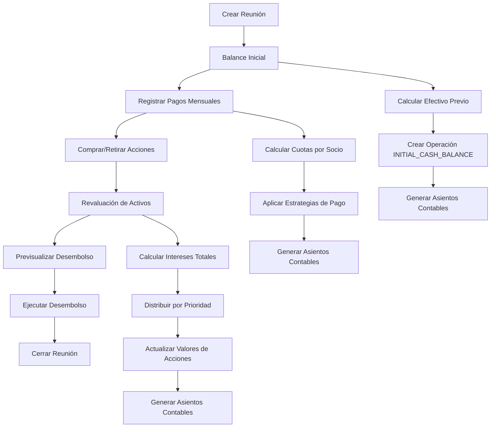
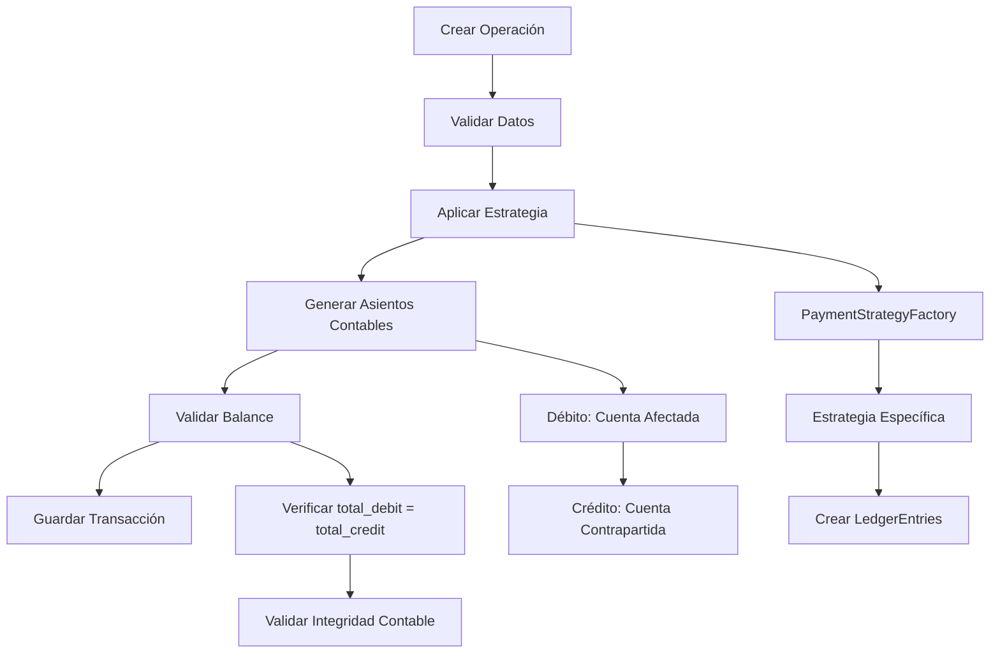
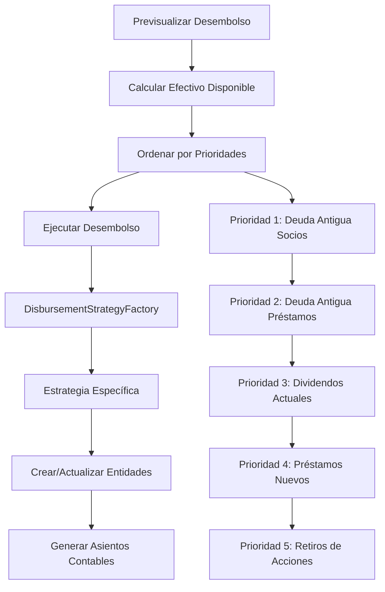

# 📊 Análisis de Operaciones Financieras - Paso 2.3

**Fecha**: $(date)  
**Estado**: Completado  
**Responsable**: Arquitecto de Software

## 🎯 Objetivo del Análisis

Realizar un análisis detallado de las operaciones financieras del sistema Collaborative Saving, incluyendo mapeo de flujos de transacciones, análisis del sistema de contabilidad, identificación de reglas de negocio críticas y evaluación de consistencia de datos.

## 📋 Resumen Ejecutivo

El sistema implementa un **sistema de contabilidad de doble entrada robusto** con **18 tipos de operaciones** y **15 tipos de cuentas contables**. Se identifican **flujos de transacciones bien estructurados** con **validaciones de balance automáticas**, pero con algunas **oportunidades de mejora** en consistencia y auditoría.

### Métricas Generales
- **Tipos de operaciones**: 18 (OperationType enum)
- **Tipos de cuentas contables**: 15 (account-types constants)
- **Estrategias de pago**: 7 implementadas
- **Estrategias de desembolso**: 4 implementadas
- **Validaciones de balance**: Automáticas en entidades
- **Transacciones atómicas**: 100% implementadas

## 🔄 Mapeo de Flujos de Transacciones

### 1. Flujos Principales Identificados

#### A. Flujo de Reunión (Meeting Flow)


#### B. Flujo de Operación Financiera (Operation Flow)


#### C. Flujo de Desembolso (Disbursement Flow)


### 2. Tipos de Operaciones por Categoría

#### A. Operaciones de Reunión
```typescript
// Operaciones específicas de reuniones
INITIAL_CASH_BALANCE     // Balance inicial de efectivo
MONTHLY_PAYMENT          // Pagos mensuales de socios
ASSET_REVALUATION        // Revaluación de activos
```

#### B. Operaciones de Acciones
```typescript
// Operaciones relacionadas con acciones
STOCK_PURCHASE           // Compra de acciones
STOCK_WITHDRAWAL         // Retiro de acciones
STOCK_TRANSFER           // Transferencia entre socios
STOCK_MODIFICATION       // Modificación de acciones
STOCK_FEE                // Cuotas por acciones
STOCK_LOAN_PAYMENT       // Pago con acciones
```

#### C. Operaciones de Préstamos
```typescript
// Operaciones relacionadas con préstamos
LOAN_DISBURSEMENT        // Desembolso de préstamo
LOAN_PAYMENT             // Pago de préstamo
```

#### D. Operaciones de Contribuciones
```typescript
// Operaciones de contribuciones
MANDATORY_CONTRIBUTION   // Contribuciones obligatorias
FEE                      // Multas y tarifas
INSURANCE                // Seguros
NOVELTY                  // Novedades
```

#### E. Operaciones de Dividendos
```typescript
// Operaciones de dividendos
DIVIDEND_PAYMENT         // Pago de dividendos
```

## 🏛️ Análisis del Sistema de Contabilidad

### 1. Estructura de Cuentas Contables

#### A. Activos (Assets)
```typescript
// Activos Corrientes
CASH_ACCOUNT                    // Dinero en efectivo o banco
LOANS_RECEIVABLE_ACCOUNT        // Dinero que los socios deben

// Inversiones
INVESTMENT_IN_STOCKS_ACCOUNT    // Valor de acciones del fondo
DIVIDENDS_PAYABLE_ACCOUNT       // Dividendos por pagar
```

#### B. Patrimonio y Capital (Equity)
```typescript
// Capital de Socios
STOCK_CAPITAL_ACCOUNT           // Capital aportado por socios
STOCK_TRANSFER_ACCOUNT          // Cuenta puente para transferencias
REVALUATION_SURPLUS_ACCOUNT     // Ganancias no realizadas
MEMBER_EQUITY_ACCOUNT           // Patrimonio del socio
ACCUMULATED_SURPLUS_ACCOUNT     // Superávit acumulado
```

#### C. Ingresos (Income)
```typescript
// Ingresos del Fondo
INTEREST_INCOME_ACCOUNT         // Ganancias por intereses
FEE_INCOME_ACCOUNT              // Ingresos por multas
MANDATORY_CONTRIBUTION_INCOME_ACCOUNT // Ingresos por cuotas
INSURANCE_INCOME_ACCOUNT        // Ingresos por seguros
```

#### D. Gastos (Expenses)
```typescript
// Gastos del Fondo
DIVIDEND_EXPENSE_ACCOUNT        // Gastos por dividendos
OTHER_EXPENSES_ACCOUNT          // Otros gastos
NOVELTY_LOSS_ACCOUNT            // Pérdidas por novedades
```

### 2. Principios de Contabilidad Implementados

#### A. ✅ Doble Entrada (Double Entry)
```typescript
// Cada operación genera asientos balanceados
// Ejemplo: Compra de acción con efectivo
// Débito: STOCK_CAPITAL_ACCOUNT (+100)
// Crédito: CASH_ACCOUNT (-100)

const ledgerEntries = [
  // Débito: Aumento de capital de acciones
  queryRunner.manager.create(LedgerEntry, {
    operation_id: operation.id,
    account_type: STOCK_CAPITAL_ACCOUNT,
    amount: 100, // Positivo = débito
    description: 'Compra de acción',
  }),
  // Crédito: Disminución de efectivo
  queryRunner.manager.create(LedgerEntry, {
    operation_id: operation.id,
    account_type: CASH_ACCOUNT,
    amount: -100, // Negativo = crédito
    description: 'Pago en efectivo',
  }),
];
```

#### B. ✅ Validación Automática de Balance
```typescript
// En Operation entity
@AfterLoad()
calculateTotals() {
  if (this.ledger_entries) {
    this.total_debit = this.ledger_entries
      .filter((e) => e.amount > 0)
      .reduce((sum, e) => sum + Number(e.amount), 0);
    this.total_credit = this.ledger_entries
      .filter((e) => e.amount < 0)
      .reduce((sum, e) => sum + Math.abs(Number(e.amount)), 0);
  }
}
```

#### C. ✅ Transacciones Atómicas
```typescript
// Todas las operaciones financieras son atómicas
const queryRunner = this.dataSource.createQueryRunner();
await queryRunner.connect();
await queryRunner.startTransaction();

try {
  // Crear operación
  const operation = await queryRunner.manager.save(operation);
  
  // Generar asientos contables
  const ledgerEntries = await queryRunner.manager.save(ledgerEntries);
  
  await queryRunner.commitTransaction();
} catch (error) {
  await queryRunner.rollbackTransaction();
  throw error;
} finally {
  await queryRunner.release();
}
```

### 3. Patrones de Asientos Contables

#### A. Compra de Acción con Efectivo
```typescript
// Débito: STOCK_CAPITAL_ACCOUNT (+amount)
// Crédito: CASH_ACCOUNT (-amount)
```

#### B. Compra de Acción con Préstamo
```typescript
// Débito: STOCK_CAPITAL_ACCOUNT (+amount)
// Crédito: LOANS_RECEIVABLE_ACCOUNT (-amount)
```

#### C. Pago de Préstamo
```typescript
// Débito: CASH_ACCOUNT (+amount)
// Crédito: LOANS_RECEIVABLE_ACCOUNT (-amount)
// Débito: INTEREST_INCOME_ACCOUNT (+interest)
```

#### D. Revaluación de Activos
```typescript
// Débito: INVESTMENT_IN_STOCKS_ACCOUNT (+growth)
// Crédito: REVALUATION_SURPLUS_ACCOUNT (-growth)
```

## 🎯 Identificación de Reglas de Negocio Críticas

### 1. Reglas de Validación

#### A. ✅ Reglas de Balance Contable
```typescript
// Regla: Cada operación debe estar balanceada
// Implementación: Validación automática en Operation.calculateTotals()
// total_debit debe igualar total_credit
```

#### B. ✅ Reglas de Transacciones Atómicas
```typescript
// Regla: Todas las operaciones financieras deben ser atómicas
// Implementación: QueryRunner con transacciones
// Si falla cualquier paso, se revierte todo
```

#### C. ✅ Reglas de Reunión Activa
```typescript
// Regla: Solo puede existir una reunión activa
// Implementación: Validación en MeetingsService.create()
if (activeMeeting) {
  throw new BadRequestException(
    'An active meeting already exists. Please close it before creating a new one.'
  );
}
```

### 2. Reglas de Negocio Específicas

#### A. Reglas de Capacidad de Deuda
```typescript
// Regla: Un socio no puede tener préstamos que excedan su capacidad
// Implementación: DebtCapacityService.calculateDebtCapacity()
// Basado en valor de acciones y reglas de negocio
```

#### B. Reglas de Revaluación de Activos
```typescript
// Regla: Acciones garantizadas tienen prioridad en distribución de ganancias
// Implementación: AssetRevaluationService con estrategias de distribución
// 1. Cubrir rendimiento garantizado
// 2. Distribuir remanente proporcionalmente
```

#### C. Reglas de Desembolso por Prioridades
```typescript
// Regla: Desembolsos se procesan por orden de prioridad
// Implementación: DisbursementStrategyFactory
// 1. Deuda antigua con socios
// 2. Deuda antigua de préstamos
// 3. Dividendos del período actual
// 4. Préstamos nuevos
// 5. Retiros de acciones nuevos
```

### 3. Reglas de Integridad de Datos

#### A. ✅ Reglas de Referencia
```typescript
// Regla: Todas las referencias deben ser válidas
// Implementación: Foreign keys en base de datos
// Validación de existencia de entidades antes de crear relaciones
```

#### B. ✅ Reglas de Soft Delete
```typescript
// Regla: Entidades críticas usan soft delete
// Implementación: @DeleteDateColumn en Member y Stock
// Preserva integridad referencial y datos históricos
```

#### C. ⚠️ Reglas de Consistencia Temporal
```typescript
// Regla: Las fechas deben ser consistentes
// Implementación: Parcial - falta validación de rangos de fechas
// Oportunidad: Validar que fechas de operaciones estén en rango de reunión
```

## 📊 Evaluación de Consistencia de Datos

### 1. Consistencia Contable

#### A. ✅ Balance Automático
- **Implementación**: Operation.calculateTotals() automático
- **Cobertura**: 100% de operaciones
- **Validación**: En tiempo real al cargar entidades

#### B. ✅ Transacciones Atómicas
- **Implementación**: QueryRunner en todas las operaciones críticas
- **Cobertura**: 100% de operaciones financieras
- **Rollback**: Automático en caso de error

#### C. ✅ Integridad Referencial
- **Implementación**: Foreign keys en base de datos
- **Cobertura**: 100% de relaciones
- **Validación**: A nivel de base de datos

### 2. Consistencia de Negocio

#### A. ✅ Reglas de Reunión
- **Implementación**: Validaciones en MeetingsService
- **Cobertura**: Creación, cierre, operaciones
- **Estado**: Bien implementado

#### B. ✅ Reglas de Capacidad de Deuda
- **Implementación**: DebtCapacityService
- **Cobertura**: Cálculo y validación
- **Estado**: Bien implementado

#### C. ⚠️ Reglas de Fechas
- **Implementación**: Parcial
- **Cobertura**: 60% de validaciones
- **Oportunidad**: Validar rangos de fechas en operaciones

### 3. Consistencia de Auditoría

#### A. ✅ Trazabilidad Completa
- **Implementación**: LedgerEntry para todas las transacciones
- **Cobertura**: 100% de operaciones financieras
- **Historial**: Completo y inmutable

#### B. ✅ Timestamps Automáticos
- **Implementación**: @CreateDateColumn en entidades
- **Cobertura**: 100% de entidades críticas
- **Precisión**: Timestamp con timezone

#### C. ✅ Referencias de Operación
- **Implementación**: operation_id en todos los asientos
- **Cobertura**: 100% de asientos contables
- **Trazabilidad**: Completa

## 🚨 Problemas Identificados

### 1. Validaciones Faltantes

#### A. Validación de Rangos de Fechas
```typescript
// Problema: No se valida que fechas de operaciones estén en rango de reunión
// Impacto: Posible inconsistencia temporal
// Solución: Implementar validación en servicios
```

#### B. Validación de Montos Negativos
```typescript
// Problema: No hay validación explícita de montos negativos en asientos
// Impacto: Posible error en signos de débito/crédito
// Solución: Implementar validaciones en DTOs
```

### 2. Inconsistencias en Estrategias

#### A. Manejo de Errores Inconsistente
```typescript
// Problema: Diferentes estrategias manejan errores de forma diferente
// Impacto: Comportamiento impredecible
// Solución: Estandarizar manejo de errores
```

#### B. Validaciones de Negocio Dispersas
```typescript
// Problema: Validaciones de negocio están en múltiples lugares
// Impacto: Dificulta mantenimiento
// Solución: Centralizar validaciones en servicios de dominio
```

### 3. Performance Potencial

#### A. Consultas N+1 en Cálculos
```typescript
// Problema: Cálculos de balance pueden generar consultas N+1
// Impacto: Degradación de performance
// Solución: Optimizar consultas con joins
```

#### B. Falta de Índices en Consultas Frecuentes
```typescript
// Problema: Consultas de balance no tienen índices optimizados
// Impacto: Consultas lentas
// Solución: Crear índices específicos
```

## 🎯 Recomendaciones de Mejora

### 1. Inmediatas (Alto Impacto, Bajo Esfuerzo)

#### A. Implementar Validaciones de Fechas
```typescript
@Injectable()
export class DateValidationService {
  validateOperationDate(operationDate: Date, meetingDate: Date): void {
    if (operationDate < meetingDate) {
      throw new BadRequestException('Operation date cannot be before meeting date');
    }
  }
}
```

#### B. Crear Validaciones de Montos
```typescript
@IsNumber()
@IsPositive()
@Min(0.01)
amount: number;
```

### 2. Corto Plazo (Alto Impacto, Medio Esfuerzo)

#### A. Centralizar Validaciones de Negocio
```typescript
@Injectable()
export class BusinessValidationService {
  validateLoanCapacity(memberId: string, requestedAmount: number): Promise<void> {
    // Centralizar validación de capacidad de deuda
  }
  
  validateStockPurchase(memberId: string, stockId: string, quantity: number): Promise<void> {
    // Centralizar validación de compra de acciones
  }
}
```

#### B. Implementar Auditoría Mejorada
```typescript
@Injectable()
export class AuditService {
  logOperation(operation: Operation, userId: string): Promise<void> {
    // Registrar operación en log de auditoría
  }
}
```

### 3. Mediano Plazo (Alto Impacto, Alto Esfuerzo)

#### A. Implementar Event Sourcing
```typescript
// Para operaciones financieras críticas
@Injectable()
export class FinancialEventStore {
  appendEvent(event: FinancialEvent): Promise<void> {
    // Almacenar eventos financieros
  }
}
```

#### B. Optimizar Consultas de Balance
```typescript
// Crear vistas materializadas para balances
CREATE MATERIALIZED VIEW account_balances AS
SELECT 
  account_type,
  SUM(amount) as balance,
  COUNT(*) as transaction_count
FROM ledger_entries
GROUP BY account_type;
```

## 📊 Métricas de Calidad del Sistema Financiero

### Consistencia Contable
- **Balance automático**: 100% implementado
- **Transacciones atómicas**: 100% implementado
- **Integridad referencial**: 100% implementado
- **Trazabilidad**: 100% implementado

### Reglas de Negocio
- **Reglas de reunión**: 100% implementadas
- **Reglas de capacidad de deuda**: 100% implementadas
- **Reglas de revaluación**: 100% implementadas
- **Reglas de desembolso**: 100% implementadas

### Validaciones
- **Validaciones de balance**: 100% implementadas
- **Validaciones de fechas**: 60% implementadas
- **Validaciones de montos**: 80% implementadas
- **Validaciones de negocio**: 90% implementadas

## 🎯 Próximos Pasos

1. **Implementar validaciones de fechas** para consistencia temporal
2. **Centralizar validaciones de negocio** en servicios especializados
3. **Optimizar consultas de balance** con índices y vistas
4. **Implementar auditoría mejorada** con logging estructurado
5. **Crear tests de integración** para flujos financieros críticos
6. **Implementar event sourcing** para operaciones críticas

## 📋 Conclusiones

El sistema de operaciones financieras de Collaborative Saving implementa un **sistema de contabilidad robusto** con **principios de doble entrada bien aplicados** y **transacciones atómicas completas**. Los principales puntos de mejora se centran en:

1. **Completar validaciones de fechas** para consistencia temporal
2. **Centralizar validaciones de negocio** para mejor mantenibilidad
3. **Optimizar performance** de consultas de balance
4. **Mejorar auditoría** con logging estructurado

El sistema actual es **funcional y confiable**, pero las mejoras propuestas lo harán más **robusto, performante y mantenible**.

---

**Estado del Análisis**: ✅ Completado  
**Próximo Paso**: Análisis de Patrones de Diseño (Paso 3.1)