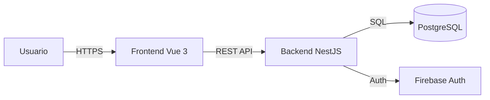

# Arquitectura

## Resumen

NestJS + Vue 3 + PostgreSQL (Supabase), siguiendo una arquitectura hexagonal estricta en el backend y feature-based en el frontend.

## Atributos de calidad

| Atributo | Prioridad | Justificación |
|---|---|---|
| Confiabilidad | Alta | Los datos financieros deben ser exactos y consistentes. |
| Modificabilidad | Alta | El sistema debe adaptarse a nuevas reglas de ahorro y préstamos. |
| Seguridad | Alta | Protección de datos personales y financieros. |
| Desplegabilidad | Media | Uso de Supabase para facilitar la infraestructura. |

## Stack técnico

- **Lenguajes:** TypeScript, SQL.
- **Framework(s):** NestJS (Backend), Vue 3 (Frontend).
- **Persistencia:** PostgreSQL (Supabase) + TypeORM.
- **Despliegue:** Docker (Backend), PostgreSQL.
- **CI/CD:** GitHub Actions.

## Patrón

El backend utiliza **Arquitectura Hexagonal**:
- **Domain:** Lógica de negocio pura (entidades, value objects, domain services).
- **Application:** Casos de uso y puertos de salida.
- **Infrastructure:** Adaptadores para base de datos, API externa, etc.

El frontend utiliza una arquitectura basada en **Features**:
- Cada feature (loans, members, stocks) encapsula sus propios componentes, stores (Pinia) y lógica.

```
collaborative-saving/
├── backend/
│   ├── src/
│   │   ├── domain/
│   │   ├── application/
│   │   └── infrastructure/
├── frontend-v2/
│   ├── src/
│   │   ├── features/
│   │   └── shared/
└── infra/
    └── database/
        └── migrations/
```

## Diagrama de componentes



## Reglas clave

- **Aislamiento del Dominio:** El dominio no puede importar nada de `infrastructure`.
- **Inmutabilidad Financiera:** Las operaciones financieras registradas no se borran, se compensan con nuevas operaciones si es necesario.
- **Validación en el Dominio:** Los invariantes de negocio deben validarse en las entidades o servicios de dominio.
- **Inyección de Dependencias (DI):** Los tokens `Symbol()` para inyección en NestJS deben estar centralizados en `src/domain/constants/injection-tokens.ts` para evitar dependencias desconocidas entre módulos.

## Docs relacionados

- [Decisiones](./adrs/) — Por qué la arquitectura se ve así.
- [Arquitectura del Frontend](./frontend/ARCHITECTURE.md) — Detalles técnicos y patrones del cliente (Vue 3, Pinia).
- [Guías de Frontend](./frontend/README.md) — Convenciones y estilos generales.
- [Modelo de datos](./data-model.md) — Esquema + relaciones.
- [Infraestructura](./infrastructure.md) — Topología de despliegue.
