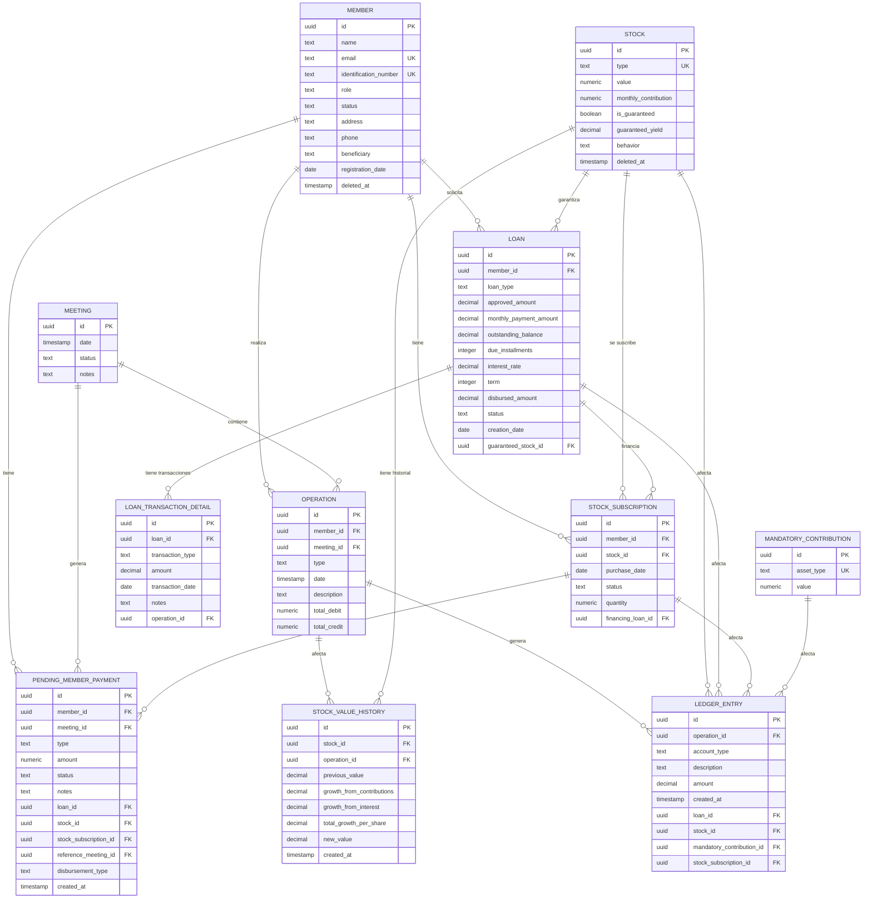

# 📊 Análisis de Entidades y Modelo de Datos - Paso 1.3

**Fecha**: $(date)  
**Estado**: Completado  
**Responsable**: Arquitecto de Software

## 🎯 Objetivo del Análisis

Realizar un análisis detallado del modelo de datos del sistema Collaborative Saving, incluyendo mapeo de relaciones entre entidades, identificación de patrones de diseño de base de datos, análisis de integridad referencial y evaluación de normalización.

## 📋 Resumen Ejecutivo

El sistema implementa un **modelo de contabilidad de doble entrada** con **13 entidades principales** bien estructuradas. Se identifican **patrones de diseño sólidos** y **buena integridad referencial**, con algunas oportunidades de optimización en normalización y relaciones.

### Métricas Generales
- **Total de entidades**: 13
- **Entidades con soft delete**: 2 (Member, Stock)
- **Relaciones Many-to-One**: 15
- **Relaciones One-to-Many**: 8
- **Constraints únicos**: 4
- **Nivel de normalización**: 3NF (Tercera Forma Normal)

## 🗂️ Mapeo de Entidades y Relaciones

### 1. Entidades Principales

| Entidad | Tabla | Propósito | Soft Delete | Constraints Únicos |
|---------|-------|-----------|-------------|-------------------|
| **Member** | `members` | Gestión de socios | ✅ | email, identification_number |
| **Stock** | `stocks` | Tipos de acciones | ✅ | type |
| **Meeting** | `meetings` | Reuniones del fondo | ❌ | - |
| **Operation** | `operations` | Operaciones financieras | ❌ | - |
| **LedgerEntry** | `ledger_entries` | Asientos contables | ❌ | - |
| **Loan** | `loans` | Préstamos a socios | ❌ | - |
| **StockSubscription** | `stock_subscriptions` | Suscripciones de acciones | ❌ | - |
| **MandatoryContribution** | `mandatory_contributions` | Contribuciones obligatorias | ❌ | asset_type |
| **StockValueHistory** | `stock_value_history` | Historial de valores | ❌ | - |
| **PendingMemberPayment** | `pending_member_payments` | Pagos pendientes | ❌ | - |
| **LoanTransactionDetail** | `loan_transaction_details` | Detalles de transacciones | ❌ | - |
| **MemberDue** | Interface | Cuotas de socios | N/A | N/A |

### 2. Diagrama de Relaciones (ERD)



## 🏛️ Patrones de Diseño de Base de Datos Identificados

### 1. ✅ Patrón de Contabilidad de Doble Entrada (Double-Entry Bookkeeping)

**Implementación:**
- **Entidad central**: `LedgerEntry`
- **Principio**: Cada transacción genera múltiples asientos que se balancean
- **Beneficio**: Garantiza integridad contable y trazabilidad completa

```typescript
// Ejemplo: Compra de acción con efectivo
// Débito: STOCK_CAPITAL_ACCOUNT (+100)
// Crédito: CASH_ACCOUNT (-100)
```

### 2. ✅ Patrón de Auditoría (Audit Trail)

**Implementación:**
- **Entidad**: `StockValueHistory`
- **Propósito**: Rastrea cambios en valores de acciones
- **Campos**: `previous_value`, `new_value`, `growth_from_contributions`, `growth_from_interest`

### 3. ✅ Patrón de Soft Delete

**Implementación:**
- **Entidades**: `Member`, `Stock`
- **Campo**: `deleted_at` (timestamp)
- **Beneficio**: Preserva datos históricos y permite recuperación

### 4. ✅ Patrón de Estado (State Pattern)

**Implementación:**
- **Entidades**: `Meeting` (active/closed), `Loan` (pending/active/paid/defaulted)
- **Beneficio**: Controla flujos de trabajo y transiciones de estado

### 5. ✅ Patrón de Transacciones Atómicas

**Implementación:**
- **Entidad**: `Operation` como contenedor de transacciones
- **Relación**: `Operation` → `LedgerEntry[]`
- **Beneficio**: Garantiza consistencia en operaciones complejas

### 6. ✅ Patrón de Pagos Pendientes

**Implementación:**
- **Entidad**: `PendingMemberPayment`
- **Propósito**: Maneja desembolsos diferidos por falta de efectivo
- **Beneficio**: Flexibilidad en gestión de liquidez

## 🔗 Análisis de Integridad Referencial

### 1. ✅ Foreign Keys Bien Definidas

| Relación | Entidad Padre | Entidad Hijo | Constraint | Estado |
|----------|---------------|--------------|------------|--------|
| Member → Operation | Member | Operation | member_id | ✅ |
| Meeting → Operation | Meeting | Operation | meeting_id | ✅ |
| Operation → LedgerEntry | Operation | LedgerEntry | operation_id | ✅ |
| Member → StockSubscription | Member | StockSubscription | member_id | ✅ |
| Stock → StockSubscription | Stock | StockSubscription | stock_id | ✅ |
| Member → Loan | Member | Loan | member_id | ✅ |
| Stock → Loan | Stock | Loan | guaranteed_stock_id | ✅ |
| Loan → LoanTransactionDetail | Loan | LoanTransactionDetail | loan_id | ✅ |
| Stock → StockValueHistory | Stock | StockValueHistory | stock_id | ✅ |
| Operation → StockValueHistory | Operation | StockValueHistory | operation_id | ✅ |
| Member → PendingMemberPayment | Member | PendingMemberPayment | member_id | ✅ |
| Meeting → PendingMemberPayment | Meeting | PendingMemberPayment | meeting_id | ✅ |

### 2. ✅ Constraints Únicos Apropiados

```sql
-- Evita duplicados críticos
ALTER TABLE members ADD CONSTRAINT uk_members_email UNIQUE (email);
ALTER TABLE members ADD CONSTRAINT uk_members_identification UNIQUE (identification_number);
ALTER TABLE stocks ADD CONSTRAINT uk_stocks_type UNIQUE (type);
ALTER TABLE mandatory_contributions ADD CONSTRAINT uk_mandatory_contributions_asset_type UNIQUE (asset_type);
```

### 3. ⚠️ Oportunidades de Mejora

#### A. Falta de Constraints de Check
```sql
-- Validaciones que podrían implementarse
ALTER TABLE loans ADD CONSTRAINT chk_loans_approved_amount CHECK (approved_amount > 0);
ALTER TABLE loans ADD CONSTRAINT chk_loans_interest_rate CHECK (interest_rate >= 0 AND interest_rate <= 1);
ALTER TABLE stock_subscriptions ADD CONSTRAINT chk_stock_subscriptions_quantity CHECK (quantity > 0);
ALTER TABLE ledger_entries ADD CONSTRAINT chk_ledger_entries_amount CHECK (amount != 0);
```

#### B. Falta de Constraints de Estado
```sql
-- Validaciones de estados
ALTER TABLE meetings ADD CONSTRAINT chk_meetings_status CHECK (status IN ('active', 'closed'));
ALTER TABLE loans ADD CONSTRAINT chk_loans_status CHECK (status IN ('pending', 'active', 'paid', 'defaulted'));
ALTER TABLE stock_subscriptions ADD CONSTRAINT chk_stock_subscriptions_status CHECK (status IN ('active', 'inactive'));
```

## 📊 Evaluación de Normalización

### 1. ✅ Primera Forma Normal (1NF)
- **Estado**: ✅ Cumplida
- **Criterio**: Todos los campos contienen valores atómicos
- **Ejemplo**: `Member.name` es un solo valor, no una lista

### 2. ✅ Segunda Forma Normal (2NF)
- **Estado**: ✅ Cumplida
- **Criterio**: No hay dependencias parciales de claves compuestas
- **Análisis**: Todas las entidades usan UUID como PK única

### 3. ✅ Tercera Forma Normal (3NF)
- **Estado**: ✅ Cumplida
- **Criterio**: No hay dependencias transitivas
- **Análisis**: Los campos no clave no dependen de otros campos no clave

### 4. ⚠️ Forma Normal de Boyce-Codd (BCNF)
- **Estado**: ⚠️ Parcialmente cumplida
- **Problema identificado**:
  ```typescript
  // En LedgerEntry, account_type podría tener dependencias funcionales
  // con los campos de referencia (loan_id, stock_id, etc.)
  ```

### 5. 🔄 Consideraciones de Desnormalización

#### A. Campos Calculados
```typescript
// Operation.total_debit y total_credit
@AfterLoad()
calculateTotals() {
  // Se calculan dinámicamente desde ledger_entries
}
```
**Justificación**: Mejora performance en consultas frecuentes

#### B. Campos Redundantes
```typescript
// Loan.outstanding_balance
// Se podría calcular desde transacciones, pero se mantiene por performance
```

## 🎯 Análisis de Tipos de Datos

### 1. ✅ Tipos Apropiados

| Campo | Tipo | Justificación |
|-------|------|---------------|
| `id` | UUID | Identificadores únicos globales |
| `amount` | DECIMAL(12,2) | Precisión monetaria |
| `interest_rate` | DECIMAL(4,4) | Tasas hasta 99.99% |
| `quantity` | NUMERIC(20,10) | Acciones fraccionarias |
| `date` | DATE/TIMESTAMP | Fechas apropiadas |

### 2. ⚠️ Oportunidades de Mejora

#### A. Enums como Text
```typescript
// Actual
@Column({ type: 'text' })
status: string;

// Mejor
@Column({ type: 'text' })
status: 'active' | 'inactive' | 'pending';
```

#### B. Campos Opcionales
```typescript
// Algunos campos podrían ser NOT NULL con valores por defecto
@Column({ type: 'text', default: 'active' })
status: string;
```

## 🔍 Análisis de Relaciones

### 1. ✅ Relaciones Bien Diseñadas

#### A. Relación Member → Operations (1:N)
- **Justificación**: Un socio puede realizar múltiples operaciones
- **Implementación**: Foreign key en `operations.member_id`

#### B. Relación Operation → LedgerEntries (1:N)
- **Justificación**: Una operación genera múltiples asientos contables
- **Implementación**: Foreign key en `ledger_entries.operation_id`

#### C. Relación Stock → StockSubscriptions (1:N)
- **Justificación**: Un tipo de acción puede tener múltiples suscripciones
- **Implementación**: Foreign key en `stock_subscriptions.stock_id`

### 2. ⚠️ Relaciones Complejas

#### A. LedgerEntry con Múltiples Referencias Opcionales
```typescript
// Puede referenciar a múltiples entidades
loan_id?: string;
stock_id?: string;
mandatory_contribution_id?: string;
stock_subscription_id?: string;
```
**Problema**: Violación de principio de responsabilidad única
**Solución**: Considerar tablas de detalle específicas

#### B. PendingMemberPayment con Referencias Múltiples
```typescript
// Similar problema de múltiples referencias opcionales
loan_id?: string;
stock_id?: string;
stock_subscription_id?: string;
```

## 🚨 Problemas Identificados

### 1. Violación de Principio de Responsabilidad Única

#### A. LedgerEntry Sobrecargada
- **Problema**: Una entidad maneja múltiples tipos de transacciones
- **Impacto**: Dificulta mantenimiento y consultas
- **Solución**: Crear entidades especializadas por tipo de transacción

#### B. PendingMemberPayment Compleja
- **Problema**: Múltiples referencias opcionales en una sola entidad
- **Impacto**: Consultas complejas y lógica condicional
- **Solución**: Dividir en entidades específicas por tipo de pago

### 2. Falta de Constraints de Validación

#### A. Validaciones de Negocio
- **Problema**: No hay constraints de check para validar reglas de negocio
- **Impacto**: Integridad de datos depende solo de la aplicación
- **Solución**: Implementar constraints de base de datos

#### B. Estados Inválidos
- **Problema**: No hay validación de transiciones de estado
- **Impacto**: Estados inconsistentes posibles
- **Solución**: Implementar máquina de estados

### 3. Performance Potencial

#### A. Consultas N+1
- **Problema**: Relaciones eager loading no optimizadas
- **Impacto**: Degradación de performance
- **Solución**: Optimizar consultas con joins explícitos

#### B. Índices Faltantes
- **Problema**: No se identifican índices específicos
- **Impacto**: Consultas lentas en tablas grandes
- **Solución**: Analizar y crear índices apropiados

## 🎯 Recomendaciones de Mejora

### 1. Inmediatas (Alto Impacto, Bajo Esfuerzo)

#### A. Implementar Constraints de Check
```sql
-- Validaciones básicas
ALTER TABLE loans ADD CONSTRAINT chk_loans_approved_amount CHECK (approved_amount > 0);
ALTER TABLE stock_subscriptions ADD CONSTRAINT chk_stock_subscriptions_quantity CHECK (quantity > 0);
ALTER TABLE ledger_entries ADD CONSTRAINT chk_ledger_entries_amount CHECK (amount != 0);
```

#### B. Crear Índices Estratégicos
```sql
-- Índices para consultas frecuentes
CREATE INDEX idx_operations_member_meeting ON operations(member_id, meeting_id);
CREATE INDEX idx_ledger_entries_operation ON ledger_entries(operation_id);
CREATE INDEX idx_loans_member_status ON loans(member_id, status);
```

### 2. Corto Plazo (Alto Impacto, Medio Esfuerzo)

#### A. Dividir LedgerEntry
```typescript
// Crear entidades especializadas
StockLedgerEntry
LoanLedgerEntry
MandatoryContributionLedgerEntry
```

#### B. Implementar Máquina de Estados
```typescript
// Para entidades con estados
enum LoanStatus {
  PENDING = 'pending',
  ACTIVE = 'active',
  PAID = 'paid',
  DEFAULTED = 'defaulted'
}
```

### 3. Mediano Plazo (Alto Impacto, Alto Esfuerzo)

#### A. Implementar Event Sourcing
- Para operaciones financieras críticas
- Mejorar auditoría y trazabilidad
- Facilitar rollbacks

#### B. Optimizar Relaciones
- Revisar relaciones N:N implícitas
- Implementar tablas de unión explícitas
- Mejorar performance de consultas

## 📈 Métricas de Calidad del Modelo

### Complejidad de Entidades

| Entidad | Campos | Relaciones | Complejidad |
|---------|--------|------------|-------------|
| LedgerEntry | 8 | 5 | Alta |
| PendingMemberPayment | 12 | 4 | Alta |
| Loan | 12 | 3 | Media |
| Operation | 8 | 3 | Media |
| Member | 10 | 4 | Media |
| Stock | 8 | 3 | Media |
| Otras | <8 | <3 | Baja |

### Cobertura de Integridad
- **Foreign Keys**: 100% implementadas
- **Constraints Únicos**: 4/13 entidades (31%)
- **Constraints de Check**: 0% implementadas
- **Soft Delete**: 2/13 entidades (15%)

## 🎯 Próximos Pasos

1. **Implementar constraints de validación** básicas
2. **Crear índices estratégicos** para performance
3. **Dividir entidades sobrecargadas** (LedgerEntry, PendingMemberPayment)
4. **Implementar máquina de estados** para entidades críticas
5. **Optimizar consultas** con joins explícitos
6. **Implementar event sourcing** para operaciones financieras

## 📋 Conclusiones

El modelo de datos de Collaborative Saving implementa una **arquitectura de contabilidad sólida** con buenas prácticas de normalización y integridad referencial. Los principales puntos de mejora se centran en:

1. **Optimización de entidades complejas** (LedgerEntry, PendingMemberPayment)
2. **Implementación de constraints de validación** para integridad de datos
3. **Mejora de performance** con índices y optimización de consultas
4. **Implementación de máquinas de estado** para control de flujos

El modelo actual es **funcional y mantenible**, pero las mejoras propuestas lo harán más **robusto, performante y escalable**.

---

**Estado del Análisis**: ✅ Completado  
**Próximo Paso**: Análisis de Servicios (Paso 2.1)