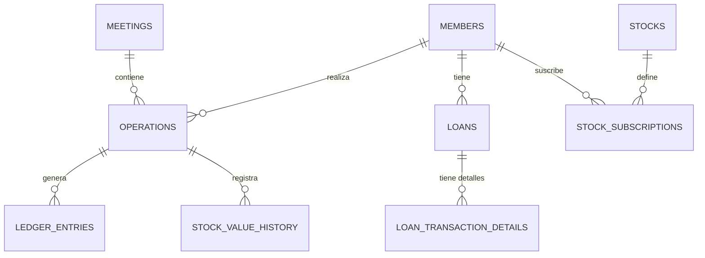

# Modelo de Datos

## Visión general

La base de datos gestiona el ciclo de vida de los socios, sus participaciones (acciones), los préstamos otorgados y el registro contable de cada movimiento financiero.

## Herramienta de migraciones

- **Herramienta:** SQL nativo / Supabase Migrations.
- **Ubicación:** `supabase/migrations/`
- **Flujo:** Las migraciones se aplican secuencialmente. Se utiliza `0001_initial_tables.sql` como base.

## Diagrama entidad-relación

## Tablas

### Core

| Tabla | Propósito | Relaciones clave |
|---|---|---|
| members | Socios del fondo. | id |
| operations | Eventos financieros de alto nivel. | member_id, meeting_id |
| ledger_entries | Registros contables de partida doble. | operation_id, loan_id, stock_id |
| loans | Préstamos otorgados. | member_id, guaranteed_stock_id |
| stocks | Definición de tipos de acciones. | id |
| stock_subscriptions | Acciones compradas por socios. | member_id, stock_id |

## Seguridad a nivel de fila / control de acceso

Se utiliza el control de acceso a nivel de aplicación (NestJS) y se planea implementar RLS (Row Level Security) en Supabase para asegurar que los socios solo vean sus propios datos sensibles.

## Docs relacionados

- [Arquitectura](./architecture.md)
- [Decisiones](./adrs/)
