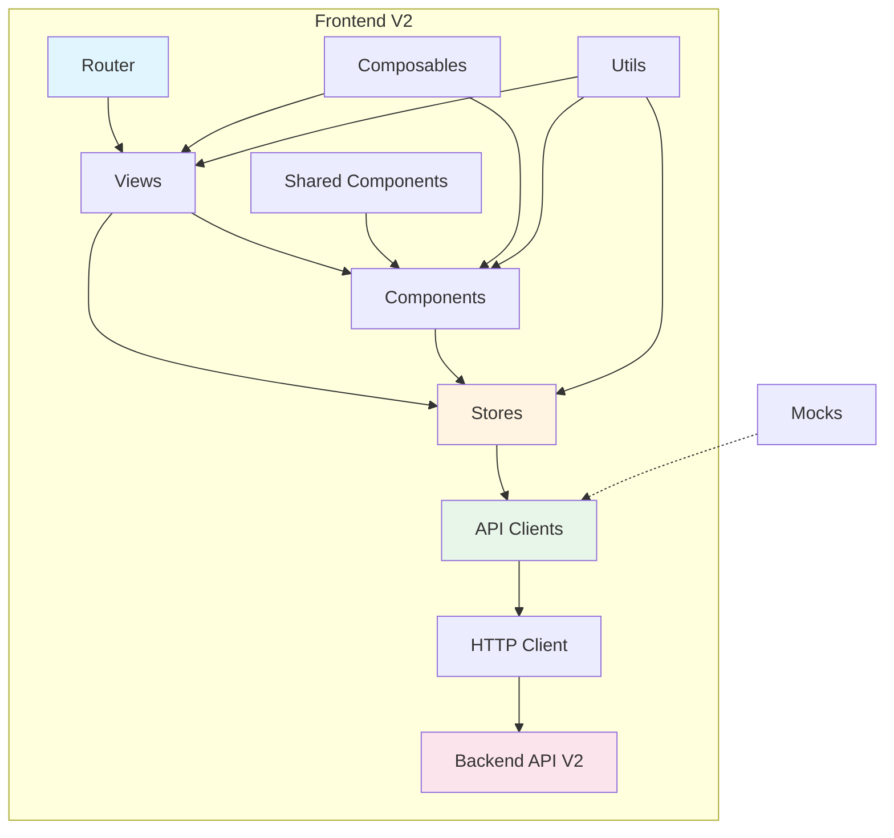
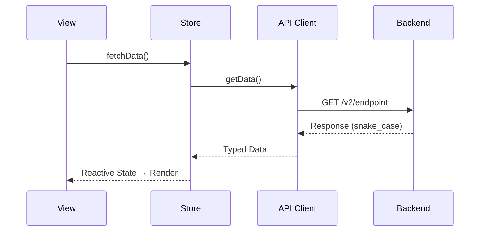
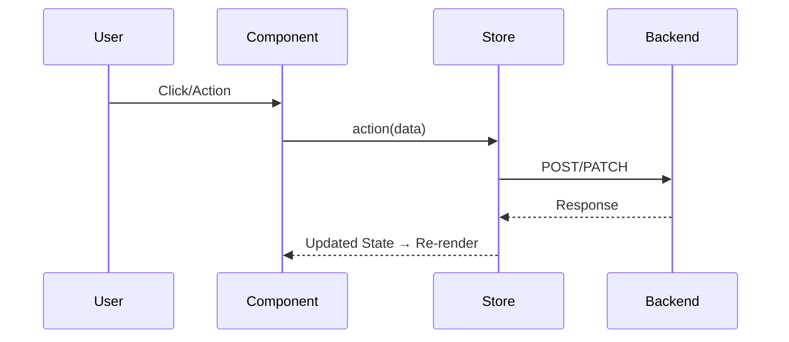

# Arquitectura del Frontend

## Principios

### 1. Feature-Based Architecture
Organizado por dominios de negocio. Cada feature es autocontenida (vistas, componentes, stores, API clients). Ver [Estructura de Carpetas](./FOLDER_STRUCTURE.md).

### 2. Separación de Concerns

| Capa | Responsabilidad |
|---|---|
| API Layer (`src/api/`) | Comunicación HTTP con backend |
| Store Layer (`src/features/*/stores/`) | Estado global y lógica de negocio |
| View Layer (`src/features/*/views/`) | Páginas y orquestación |
| Component Layer | UI reutilizable (shared + feature) |

### 3. Composition over Configuration
Uso extensivo de Composables, Composition API de Vue 3 y composición de componentes con slots.

### 4. Type Safety First
TypeScript en todo: APIs tipadas, interfaces para props/eventos, tipos compartidos en `shared/types`.

## Diagrama General

## Flujo de Datos

### Cargar Datos

### Acción del Usuario

## Capas en Detalle

### API Layer (`src/api/`)
- Cliente HTTP base con interceptores y manejo centralizado de errores
- Un archivo `.api.ts` por módulo del backend
- Trabaja directamente con `snake_case` (sin normalización a camelCase)
- Sistema de mocks con `VITE_USE_MOCKS`

> Ver [Guía de API](./API_GUIDE.md) para patrones y ejemplos.

### Store Layer (Pinia)
- Setup syntax con `defineStore`
- State (`ref`), Actions (`async functions`), Getters (`computed`)
- Manejo de `loading` y `error` en cada action

> Ver [Guía de Stores](./STORES_GUIDE.md) para patrones y ejemplos.

### View Layer
- Componentes de página que orquestan stores y componentes
- Manejo de routing, estados de carga/error/vacío

### Component Layer
- **Feature** (`src/features/*/components/`): específicos de un dominio
- **Shared** (`src/shared/components/`): reutilizables, sin dependencias de features

> Ver [Guía de Componentes](./COMPONENTS_GUIDE.md) para patrones y ejemplos.

## Decisiones Arquitectónicas

- **[ADR-0013: Decisiones Técnicas Frontend V2](../adrs/0013-decisiones-tecnicas-frontend-v2.md)**

## Referencias

- [Estructura de Carpetas](./FOLDER_STRUCTURE.md)
- [Convenciones de Código](./CODING_CONVENTIONS.md)
