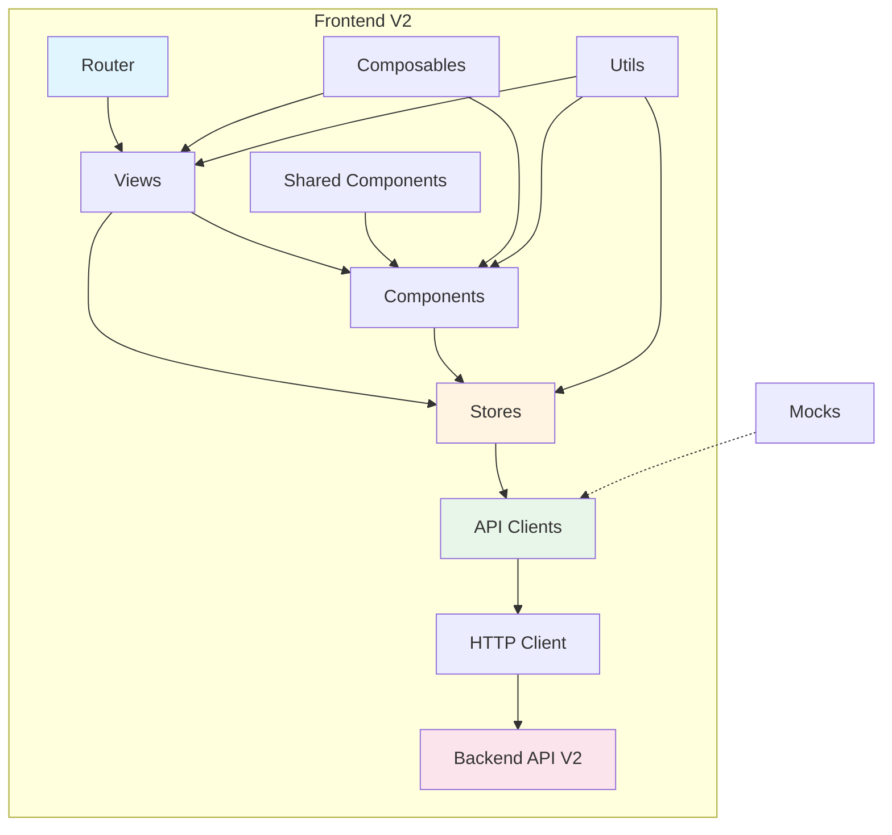
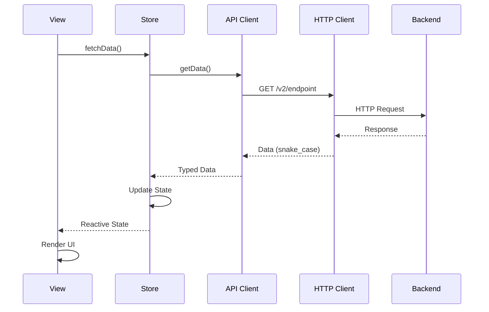
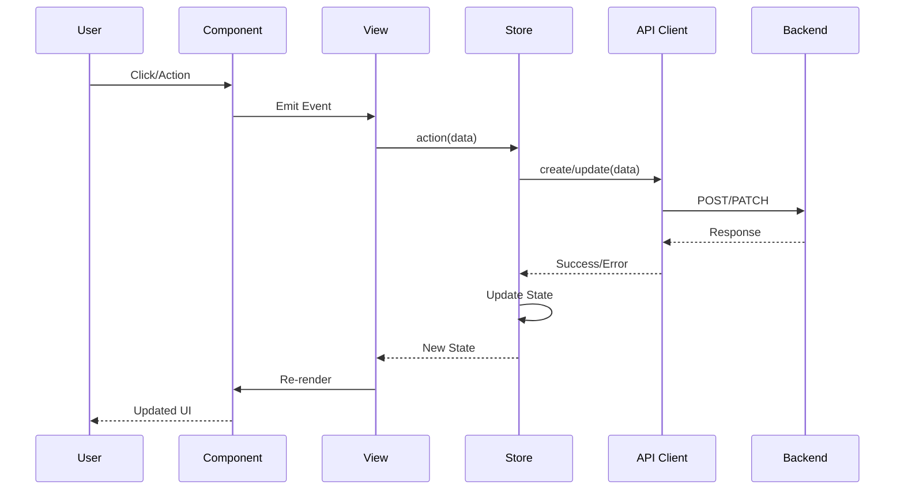

# Arquitectura del Frontend

## Introducción

Este documento describe la arquitectura general del frontend V2, sus principios de diseño, decisiones arquitectónicas y el flujo de datos.

## Principios Arquitectónicos

### 1. Feature-Based Architecture

El proyecto está organizado por **features** (dominios de negocio) en lugar de por tipo de archivo. Cada feature es autocontenida y agrupa todo lo relacionado con un dominio específico.

**Beneficios:**
- Fácil de navegar y entender
- Escalable - nuevas features no afectan existentes
- Facilita el trabajo en equipo (menos conflictos)
- Mejor encapsulación

### 2. Separación de Concerns

Cada capa tiene responsabilidades claras:

- **API Layer**: Comunicación con el backend
- **Store Layer**: Estado global y lógica de negocio
- **View Layer**: Presentación y UI
- **Component Layer**: Componentes reutilizables

### 3. Composition over Configuration

Uso extensivo de:
- **Composables** para lógica reutilizable
- **Composition API** de Vue 3
- **Composición de componentes** con slots

### 4. Type Safety First

TypeScript en todo el código:
- Tipos explícitos para APIs
- Interfaces para props y eventos
- Tipos compartidos en `shared/types`

## Arquitectura General



## Flujo de Datos

### Flujo Típico: Cargar Datos



### Flujo Típico: Acción del Usuario



## Estructura de Capas

### 1. API Layer (`src/api/`)

**Responsabilidad**: Comunicación con el backend

- Cliente HTTP base con interceptores
- Clientes específicos por módulo
- Manejo de errores centralizado
- Tipos TypeScript para requests/responses
- Sistema de mocks para desarrollo

**Características:**
- Trabaja directamente con `snake_case`
- Sin normalización a `camelCase`
- Tipado completo con TypeScript

### 2. Store Layer (`src/features/*/stores/`)

**Responsabilidad**: Estado global y lógica de negocio

- Stores de Pinia por feature
- Estado reactivo
- Actions para operaciones asíncronas
- Getters para datos derivados
- Manejo de loading y error states

**Patrón:**
```typescript
export const useFeatureStore = defineStore('feature', () => {
  // State
  const data = ref<Type[]>([])
  const loading = ref(false)
  const error = ref<string | null>(null)
  
  // Actions
  async function fetchData() { /* ... */ }
  
  // Getters (computed)
  const hasData = computed(() => data.value.length > 0)
  
  return { data, loading, error, fetchData, hasData }
})
```

### 3. View Layer (`src/features/*/views/`)

**Responsabilidad**: Páginas y vistas principales

- Componentes de página
- Orquestación de componentes
- Manejo de routing
- Estados de loading/error
- Composición de stores y composables

**Estructura típica:**
```vue
<script setup lang="ts">
import { useFeatureStore } from '../stores/feature'
import FeatureComponent from '../components/FeatureComponent.vue'

const store = useFeatureStore()
onMounted(() => store.fetchData())
</script>

<template>
  <div>
    <LoadingSpinner :loading="store.loading" />
    <ErrorMessage :error="store.error" />
    <FeatureComponent v-if="store.hasData" :data="store.data" />
  </div>
</template>
```

### 4. Component Layer

**Componentes Específicos** (`src/features/*/components/`)
- Componentes usados solo en una feature
- Encapsulan lógica específica del dominio

**Componentes Compartidos** (`src/shared/components/`)
- Componentes reutilizables
- Sin dependencias de features
- Altamente configurables

## Decisiones Arquitectónicas (ADR)

Para consultar las decisiones técnicas fundamentales de arquitectura y desarrollo del frontend, dirígete al registro oficial de ADRs globales:

- **[ADR-0013: Decisiones Técnicas Frontend V2](../adrs/0013-decisiones-tecnicas-frontend-v2.md)**

## Patrones de Diseño

### 1. Repository Pattern (API Clients)

Los API clients actúan como repositorios, abstraen la comunicación HTTP:

```typescript
export const membersApi = {
  async getMembers(): Promise<Member[]> { /* ... */ },
  async getMemberById(id: string): Promise<Member> { /* ... */ }
}
```

### 2. Store Pattern (Pinia)

Stores centralizan estado y lógica:

```typescript
const store = defineStore('name', () => {
  // State + Actions + Getters
})
```

### 3. Component Composition

Componentes pequeños y composables:

```vue
<DataTable :data="items" :columns="columns">
  <template #actions="{ item }">
    <button @click="edit(item)">Edit</button>
  </template>
</DataTable>
```

### 4. Composable Pattern

Lógica reutilizable extraída a composables:

```typescript
export function useApi<T>() {
  const loading = ref(false)
  const error = ref<string | null>(null)
  // ...
  return { loading, error, execute }
}
```

## Convenciones de Naming

Ver [CODING_CONVENTIONS.md](./CODING_CONVENTIONS.md) para detalles completos.

**Resumen:**
- Features: `kebab-case` (ej: `member-detail`)
- Components: `PascalCase` (ej: `MemberCard.vue`)
- Stores: `camelCase` (ej: `useMemberStore`)
- API clients: `camelCase` + `Api` (ej: `membersApi`)
- Types: `PascalCase` (ej: `MemberResponse`)

## Referencias

- [Estructura de Carpetas](./FOLDER_STRUCTURE.md)
- [Guía de Features](./FEATURES_GUIDE.md)
- [Guía de Stores](./STORES_GUIDE.md)
- [Guía de API](./API_GUIDE.md)

