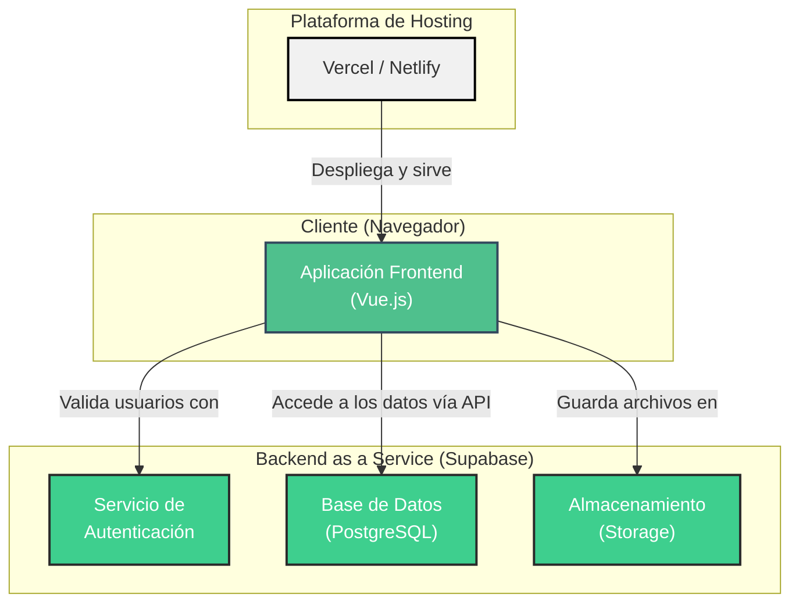

# 🎨 Fase 2: Diseño de la Solución

---

## 🏛️ 1. Arquitectura y Stack Tecnológico

Tras un análisis colaborativo, hemos decidido optar por una arquitectura moderna y eficiente que nos permita desarrollar de manera ágil y sostenible, ideal para un proyecto no lucrativo.

**Decisiones clave:**
-   **Frontend:** Vue.js 3
-   **Backend:** Supabase (Backend as a Service)

### Diagrama de Arquitectura del Sistema

Este diagrama muestra la estructura general de la aplicación, identificando los componentes principales y sus interacciones.



### Stack Tecnológico Detallado

| Componente      | Tecnología        | Razón de la elección                                                                                   |
|-----------------|-------------------|--------------------------------------------------------------------------------------------------------|
| **Frontend**    | **Vue.js 3**      | Framework progresivo, con una curva de aprendizaje amigable y un excelente rendimiento para SPAs.        |
| **UI Framework**| **Tailwind CSS + daisyUI** | Se usará Tailwind por su flexibilidad para crear diseños a medida. Se añade daisyUI para disponer de componentes pre-construidos (botones, modales, etc.), acelerando el desarrollo. |
| **Backend**     | **Supabase**      | Solución todo-en-uno que nos provee base de datos, autenticación y APIs, acelerando el desarrollo.     |
| **Base de Datos**| **PostgreSQL**    | Base de datos relacional potente, ideal para la estructura de datos del fondo. Gestionada por Supabase. |
| **Hosting**     | **Vercel/Netlify**| Plataformas optimizadas para el despliegue de aplicaciones frontend modernas.                             |
```