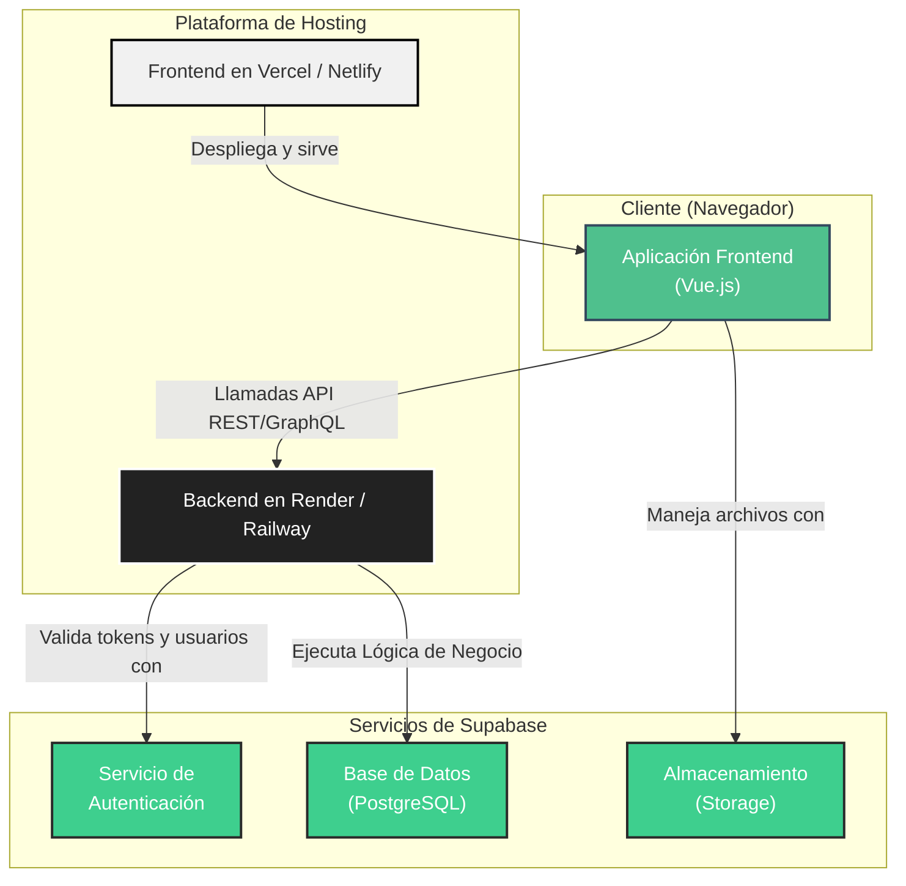
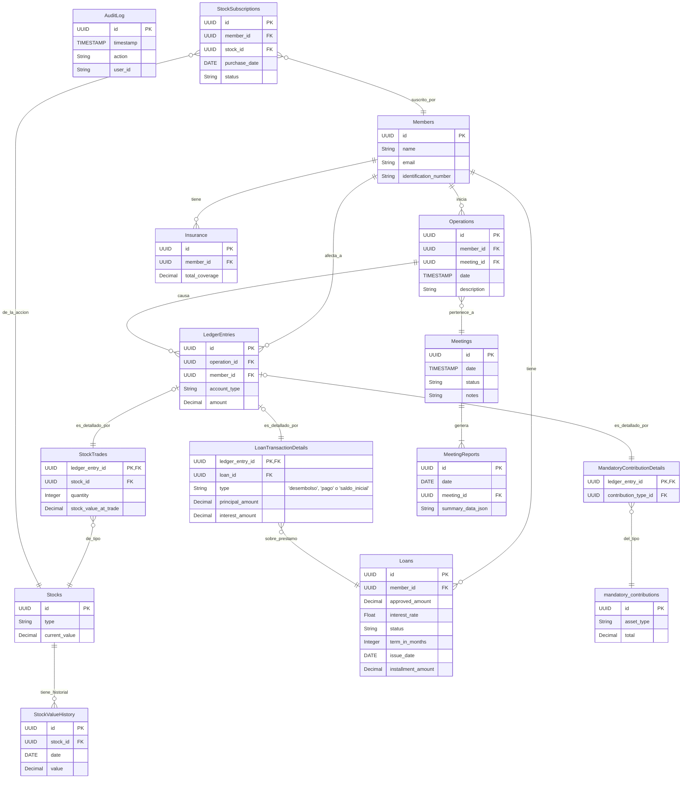

# 🎨 Fase 2: Diseño de la Solución

---

## 🏛️ 1. Arquitectura y Stack Tecnológico

Tras una reevaluación colaborativa, hemos decidido pivotar hacia una arquitectura con un **backend dedicado**. Esta decisión se toma para tener un mayor control sobre la lógica de negocio, facilitar las pruebas y el mantenimiento a largo plazo, especialmente dada la complejidad del modelo de libro contable.

**Decisiones clave:**
-   **Frontend:** Vue.js 3
-   **Backend:** NestJS (Node.js) sobre un servidor dedicado.
-   **Base de Datos, Auth y Storage:** Supabase (utilizado como proveedor de servicios).

### Diagrama de Arquitectura del Sistema

Este diagrama muestra la nueva estructura de la aplicación, con un backend dedicado que maneja la lógica de negocio y se comunica con los servicios de Supabase.

### Stack Tecnológico Detallado

| Componente      | Tecnología        | Razón de la elección                                                                                   |
|-----------------|-------------------|--------------------------------------------------------------------------------------------------------|
| **Frontend**    | **Vue.js 3**      | Framework progresivo, con una curva de aprendizaje amigable y un excelente rendimiento para SPAs.        |
| **UI Framework**| **Tailwind CSS + daisyUI** | Se usará Tailwind por su flexibilidad para crear diseños a medida. Se añade daisyUI para disponer de componentes pre-construidos (botones, modales, etc.), acelerando el desarrollo. |
| **Backend**     | **NestJS (Node.js)** | Framework robusto y escalable, ideal para construir APIs eficientes y mantener una lógica de negocio compleja, separada y bien estructurada. |
| **Base de Datos**| **PostgreSQL (vía Supabase)** | Base de datos relacional potente, ideal para la estructura de datos del fondo. Gestionada por Supabase para facilitar la administración. |
| **Autenticación**| **Supabase Auth**   | Se mantiene Supabase para la gestión de usuarios, tokens (JWT) y políticas de seguridad. El backend validará los tokens generados por Supabase. |
| **Hosting Frontend**| **Vercel/Netlify**| Plataformas optimizadas para el despliegue de aplicaciones frontend modernas.                             |
| **Hosting Backend** | **Render/Railway**  | Plataformas que facilitan el despliegue de aplicaciones de servidor, bases de datos y otros servicios backend, ideales para NestJS. |

---

## 💾 2. Diseño de la Base de Datos

Para manejar la complejidad de las transacciones financieras, hemos optado por un **modelo de "Libro Contable" normalizado**. Este enfoque proporciona máxima flexibilidad, trazabilidad y robustez. La decisión clave es que **no se almacenarán saldos ni totales precalculados**; en su lugar, todos los balances se calcularán al vuelo a partir de los registros de transacciones para garantizar la máxima integridad de los datos. La migración de datos existentes se manejará creando "asientos de apertura" o de "saldo inicial".

### Diagrama Entidad-Relación (ERD) Final Normalizado

Este diagrama representa la estructura completa y final de la base de datos que se implementará.

COMMENT ON TABLE public.mandatory_contributions IS 'Stores mandatory, recurring contribution types and amounts.';

### 3. Visión General y Observaciones del Modelo

El modelo de datos diseñado es robusto, normalizado y sigue el enfoque de **"libro contable" (Ledger-based)**. Esta es una excelente elección para una aplicación que requiere alta integridad y trazabilidad de las transacciones financieras.

**Puntos Fuertes:**

1.  **Máxima Integridad:** Al no almacenar saldos calculados y derivar todos los balances directamente de los `LedgerEntries` (asientos contables), se elimina casi por completo el riesgo de inconsistencias en los datos. Cada estado financiero es una consecuencia directa de su historial de transacciones.
2.  **Trazabilidad Completa (Auditabilidad):** Cada cambio que afecta el patrimonio de un miembro o del fondo está registrado como una `Operation` que genera uno o más `LedgerEntries`. Esto crea una pista de auditoría completa y fácil de seguir, ideal para la transparencia que requiere un fondo de ahorro.
3.  **Flexibilidad y Escalabilidad:** El modelo es muy flexible. Si en el futuro aparece un nuevo tipo de producto o transacción (ej. fondos de inversión, seguros adicionales), solo se necesita crear una nueva tabla de "detalles" (como `StockTrades` o `LoanTransactionDetails`) y vincularla a `LedgerEntries`, sin necesidad de modificar el núcleo del sistema contable.
4.  **Separación de Conceptos:** El modelo distingue claramente entre la `Operation` (el evento del mundo real, ej: "Juan solicitó un préstamo en la reunión X") y los `LedgerEntries` (los impactos contables de ese evento, ej: "un débito a la cuenta de préstamos de Juan, un crédito a la cuenta de efectivo del fondo").

**Observaciones y Consideraciones:**

1.  **Complejidad en las Consultas:** El principal desafío de este enfoque es que la obtención de saldos o estados de cuenta requiere agregar un gran número de registros. Por ejemplo, para saber el saldo de un miembro, se debe hacer un `SUM` de todos sus `LedgerEntries`. Esto puede volverse lento a medida que el volumen de datos crezca.
    *   **Solución:** La lógica para estas agregaciones complejas vivirá en el **backend de NestJS**. Se crearán `services` y `repositories` que contendrán métodos específicos para calcular saldos (`getMemberBalance`), obtener estados de cuenta, etc. Esto centraliza la lógica, la hace reutilizable y permite optimizarla. Para el frontend, la consulta será una simple llamada a un endpoint (`GET /api/members/:id/balance`). Adicionalmente, se pueden crear **vistas (Views) de base de datos** para pre-agregar datos si el rendimiento lo requiere.
2.  **Lógica de Negocio en el Backend:** La creación de una `Operation` requerirá una lógica cuidadosa para generar los `LedgerEntries` correctos (el principio de la partida doble: débitos y créditos). **Esta lógica vivirá en el backend de NestJS** y es crítica para la integridad del sistema.
3.  **Reportes Complejos:** La generación de reportes que abarquen largos períodos de tiempo o que requieran múltiples cálculos (ej. "evolución del patrimonio total del fondo durante el último año") será computacionalmente intensiva. Al igual que con los saldos, las vistas o vistas materializadas son la estrategia a seguir.

**Conclusión:**

El modelo de datos es **excelente y profesional** para el propósito de la aplicación. Prioriza la corrección y la auditoría sobre la simplicidad de las consultas, lo cual es la decisión correcta para un sistema financiero. Al mover la lógica de negocio a un backend dedicado con NestJS, las consideraciones de rendimiento y complejidad se gestionan de manera centralizada, robusta y escalable.